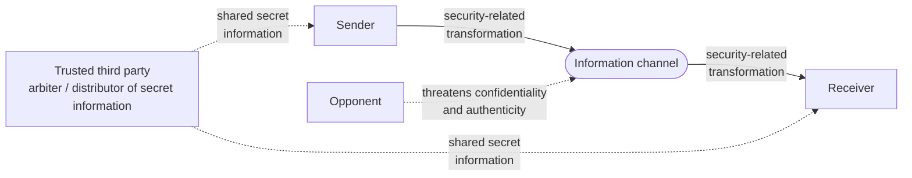

# Network Security Fundamentals

> **Source:** `Module 1/Computer Network Security Introduction.pptx`, slides 1–9 · **Syllabus:** Unit I

## Key points

- **Computer security** (NIST) = protecting an automated information system so as to preserve the **integrity, availability and confidentiality** of its resources.
- The **CIA triad** — Confidentiality, Integrity, Availability — is the set of fundamental security objectives; NIST **FIPS 199** codifies it.
- Two further essential requirements sit alongside the triad: **authenticity** and **accountability**.
- Security is hard because attackers need *one* weakness while designers must close *all* of them.
- Every security technique has two components: a **security-related transformation** on the data, and **secret information** shared by the two principals.
- The **network security model** covers data in transit; the **network access security model** covers unwanted access to the system itself.

---

## 1. Defining computer and network security

The **NIST Computer Security Handbook** defines *computer security* as:

> "the protection afforded to an automated information system in order to attain the applicable objectives of preserving the integrity, availability and confidentiality of information system resources"

Here *resources* includes **hardware, software, firmware, information/data, and telecommunications**.

**Computer and network security** consists of:

> "measures to deter, prevent, detect, and correct security violations that involve the transmission of information"

*(NIST = National Institute of Standards and Technology.)*

Note the four verbs — **deter, prevent, detect, correct**. Security is not only about stopping attacks; detection and recovery are equal parts of the definition.

## 2. Fundamental security objectives (the CIA triad)

| Objective | Sub-concept | Meaning |
|---|---|---|
| **Confidentiality** | Data confidentiality | Private or confidential information is not made available or disclosed to unauthorized individuals. |
| | Privacy | Individuals maintain authority over their personal data — deciding **how, when, and to what extent** their information is communicated to others. |
| **Integrity** | Data integrity | Information and programs are changed only in a **specified and authorized** manner. |
| | System integrity | A system performs its intended function in an unimpaired manner, free from deliberate or inadvertent unauthorized manipulation. |
| **Availability** | — | Systems work promptly and service is **not denied** to authorized users. |

These three concepts form the **CIA triad**, and embody the fundamental security objectives for both *data* and *information and computing services*.

**FIPS 199** (*Standards for Security Categorization of Federal Information and Information Systems*) is the NIST standard that lists confidentiality, integrity and availability as the three security objectives for information and information systems.

## 3. Essential security requirements beyond CIA

Two further requirements are usually added to the triad:

**Authenticity**
- The property of being **genuine** and being able to be **verified and trusted**.
- Means verifying that users are who they say they are, and that each input arriving at the system came from a **trusted source**.

**Accountability**
- The security goal that generates the requirement for actions of an entity to be **traced uniquely to that entity**.
- Systems must keep records of their activities to permit later **forensic analysis** — to trace security breaches or to help settle transaction disputes.

> Accountability is what makes an audit trail meaningful; see [security audit trail](02-osi-security-architecture-x800.md#pervasive-security-mechanisms) among the X.800 pervasive mechanisms.

## 4. Computer security challenges

Security "is not as simple as it might first appear to the novice". The requirements carry simple one-word labels — *confidentiality*, *authentication*, *integrity* — yet the mechanisms that fulfil them are quite complex. The recurring difficulties:

1. **Deceptively simple requirements.** Simple one-word goals hide complex mechanisms.
2. **You must anticipate attacks.** When creating security code, assume attacks; the *unexpected* vulnerabilities are often the most effective ones.
3. **Placement matters.** Both the **physical** placement of a mechanism in a network and its **logical** placement within an architecture such as TCP/IP.
4. **More than algorithms.** Mechanisms need **shared secret information**, which raises its own problems of creation, distribution and protection. Reliance on complex communication protocols complicates development further.
5. **Asymmetric battle.** Security is a contest between attackers finding weaknesses and designers closing them — **attackers need only one weakness; designers must eliminate all of them** for perfect security.
6. **No visible benefit until failure.** Users and managers perceive little benefit from security investment until a security failure occurs.
7. **Constant monitoring required**, which is difficult in an overloaded environment.
8. **Afterthought, not design.** Security is too often bolted on rather than being an integral part of the design.

## 5. Model for network security

A message is to be transferred from one party to another across some sort of Internet service. The two principals must cooperate for the exchange to take place, and an **opponent** may threaten confidentiality, authenticity, or both.

All the techniques for providing security have **two components**:

1. A **security-related transformation** on the information to be sent — e.g. encryption of the message, or the addition of a code derived from the message contents that can verify the sender's identity.
2. Some **secret information shared by the two principals** and, it is hoped, unknown to the opponent — e.g. an encryption key used with the transformation.

A **trusted third party** may be needed to achieve secure transmission — for instance to distribute the secret information to the two principals while keeping it from the opponent, or to arbitrate disputes between them about the authenticity of a message.

## 6. Model for network access security

A general model that reflects a concern for protecting an **information system from unwanted access**. The threats are of two kinds:

- **Information access threats** — intercept or modify data on behalf of users who should not have access.
- **Service threats** — exploit service flaws in computers to inhibit use by legitimate users.

The security mechanisms needed to cope with unwanted access fall into **two broad categories**:

1. **Gatekeeper functions** — e.g. a login procedure, password-based logic designed to reject all but authorized users, and screening logic designed to detect and reject worms, viruses and other similar attacks.
2. **Internal controls** — a variety of controls that **monitor activity and analyze stored information** in an attempt to detect the presence of unwanted intruders.

Hackers and unwanted software (viruses, worms) are the two classes of intruder this model defends against. For the software threats themselves, see [Malware and Back Doors](../module-2/03-malware-and-backdoors.md).
