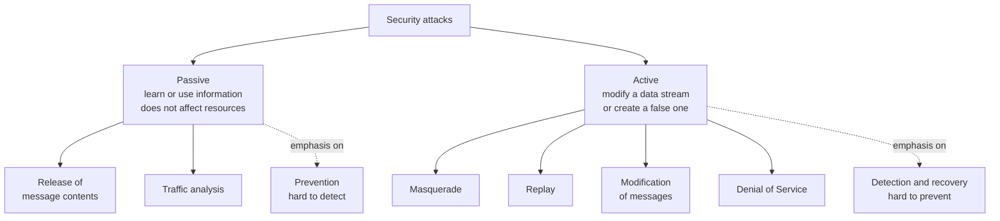

# OSI Security Architecture (X.800)

> **Source:** `Module 1/Computer Network Security Introduction.pptx`, slides 10–27 · **Syllabus:** Unit I

## Key points

- **X.800** is the ITU-T's OSI Security Architecture. It organises the field into three things: **security attacks, security mechanisms, security services**.
- Attacks split into **passive** (eavesdropping — hard to detect, so *prevent*) and **active** (modification/fabrication — hard to prevent, so *detect and recover*).
- Passive attacks: **release of message contents**, **traffic analysis**.
- Active attacks: **masquerade, replay, modification of messages, denial of service**.
- Five security services: **authentication, access control, data confidentiality, data integrity, non-repudiation**.
- Mechanisms split into **specific** (tied to a protocol layer) and **pervasive** (not tied to any layer).

---

## 1. The X.800 standard

**Open Systems Interconnection (OSI) Architecture X.800** is a set of standards relating to the security of information. They were developed by the **International Telecommunication Union (ITU-T)**, a UN-sponsored body responsible for telecommunications standards.

The standards pertain to three areas:

| Term | Definition |
|---|---|
| **Security attack** | Actions intending to compromise the security of information belonging to an organization. |
| **Security mechanism** | The processes (or devices incorporating those processes) designed to **prevent, detect, or recover from** security attacks. |
| **Security service** | A processing or communication service that enhances the security of the data processing systems and information transfers of an organization. Services **make use of security mechanisms** to counter security attacks. |

**Threats vs. attacks.** Per **RFC 4949**, the terms *threat* and *attack* are commonly used to mean more or less the same thing.

## 2. Security attacks

X.800 classifies attacks into two broad classes.

| | **Passive attack** | **Active attack** |
|---|---|---|
| What it does | Attempts to **learn or make use of information** from the system | Involves **modification of a data stream or creation of a false stream** |
| Effect on resources | Does **not** affect system resources | Modifies data or system state |
| Nature | Eavesdropping on, or monitoring of, transmissions | Interference with transmissions |
| Adversary goal | Capture information, or obtain the **pattern** of information flows | Modify the data stream, or create a false stream |
| Detectability | **Very difficult to detect** — the intruder only listens and alters nothing | Detectable, but difficult to prevent absolutely |
| Countermeasure emphasis | **Prevention** rather than detection | **Detection and recovery** |

### Types of passive attack

**Unauthorized disclosure of message contents** (release of message contents)
- Release of sensitive or confidential information — obtained by brute force or by sophisticated cryptanalysis techniques.

**Traffic analysis**
- Observe the **pattern** of the messages rather than their content.
- The adversary can observe the **frequency and length** of messages being exchanged.
- This can provide leads to the nature of the information being transmitted. For example, in a defence context, **increased message frequency may signal imminent operations**.
- Works even when contents are encrypted — which is why [traffic padding](#specific-security-mechanisms) exists as a countermeasure.

### Types of active attack

| Attack | Definition | Worked example |
|---|---|---|
| **Masquerade** | One entity pretends to be a different entity. | Entity **A** pretends to be **B** and sends a message to **C**. Possible if A captures B's authentication sequences and replays them. C believes the message came from B. |
| **Replay** | Passive capture of a data unit and its subsequent retransmission to produce an unauthorized effect. | The message *"ARRIVING TODAY AT 4:00 PM"* is captured on 15 July 2009 and replayed on 17 July 2009 — the recipient wrongly believes the sender arrives on the 17th. |
| **Modification of messages** | Some portion of a legitimate message is altered, or messages are delayed or reordered, to produce an unauthorized effect. | Capturing, altering and re-transmitting a data stream. Altering may mean **modification, deletion, appending, or reordering**. |
| **Denial of Service (DoS)** | Prevents or inhibits the normal use or management of communications facilities. | The adversary **suppresses or floods** the network, delaying or losing valid messages. |

> A masquerade attack usually incorporates one of the other three forms of active attack. For the modern network-level realisations of these — IP spoofing, MITM, DDoS — see [DoS, Spoofing and Man-in-the-Middle](../module-2/04-dos-spoofing-and-mitm.md).

## 3. Security services

X.800 defines five categories of service.

### 3.1 Authentication

**The assurance that the communicating entity is the one that it claims to be.** Of two kinds:

- **Peer-entity (peer-to-peer) authentication** — specific to a **connection-oriented** environment. Provides confidence to the recipient against **masquerade**, i.e. against unauthorized replay of previous connections.
- **Data-origin authentication** — specific to a **connection-less** environment. Provides data source authentication: it assures the recipient that the received message was sent by the alleged sender only.

### 3.2 Access control

**The prevention of unauthorized use of a resource.** This service controls:

- **who** can have access to a resource,
- **under what conditions** access can occur, and
- **what** those accessing the resource are allowed to do.

### 3.3 Data confidentiality

**The protection of data from unauthorized disclosure.**

| Variant | Protects |
|---|---|
| **Connection confidentiality** | All user data on a connection. |
| **Connectionless confidentiality** | All user data in a single data block. |
| **Selective-field confidentiality** | Selected fields within the user data on a connection or in a single data block. |
| **Traffic-flow confidentiality** | The information that might be derived from **observation of traffic flows** (counters traffic analysis). |

### 3.4 Data integrity

**The assurance that data received are exactly as sent by an authorized entity** — containing no modification, insertion, deletion or replay.

| Variant | Provides |
|---|---|
| **Connection integrity with recovery** | Integrity of all user data on a connection; detects any modification, insertion, deletion or replay within an entire data sequence, **with recovery attempted**. |
| **Connection integrity without recovery** | As above, but **detection only**, no recovery. |
| **Selective-field connection integrity** | Integrity of selected fields within the user data of a data block on a connection; determines whether the selected fields have been modified, inserted, deleted or replayed. |
| **Connectionless integrity** | Integrity of a **single connectionless data block**; takes the form of detection of data modification. A limited form of **replay detection** may also be provided. |
| **Selective-field connectionless integrity** | Integrity of selected fields within a single connectionless data block; determines whether those fields have been modified. |

### 3.5 Non-repudiation

**Protection against denial, by one of the entities involved in a communication, of having participated in all or part of the communication.**

- **Non-repudiation, origin** — proof that the message was sent by the specified party. The **sender signs the message with their private key**; the recipient verifies with the sender's public key.
- **Non-repudiation, destination** — proof that the message was received by the specified party. The **recipient must acknowledge receipt**.

## 4. Security mechanisms

X.800 defines mechanisms under **two major categories**.

### Specific security mechanisms

A mechanism that **pertains to a particular layer of protocol**. There are seven:

**1. Enciphering / deciphering**
- Encryption uses mathematical algorithms and a key to transform **plaintext into ciphertext**; decryption transforms ciphertext back into plaintext using algorithms and a secret key.
- **Symmetric cryptography** uses one key for both directions; **public-key cryptography** uses two different (but related) keys.
- Enciphering and deciphering primarily involve **substitution and permutation**.

**2. Digital signature**
- A **hash of a message, encrypted with the sender's private key** and attached to the message. Used in public-key cryptography. It serves four purposes:
  - **Verifies the sender's identity** — the recipient deciphers the signature using the sender's public key.
  - **Proves data-unit integrity** — assures the recipient the data unit was not altered in transit, intentionally or unintentionally.
  - **Protects data from forgery** — the recipient cannot alter the document or the signature.
  - **Assures source non-repudiation** — the sender cannot refute sending the message, since the recipient can prove the signature could only have been generated with the sender's private key.

**3. Access control**
- Limits access to system resources. Entities must **identify and authenticate** themselves to gain authorized access.

**4. Data integrity**
- A **checksum or CRC** is computed at the sender end and appended to the data unit. At the recipient's end the checksum/CRC is recomputed and compared with the received value. If the values match, the data unit was received correctly.

**5. Traffic padding**
- Padding prevents eavesdroppers from determining **message length and frequency**, protecting against **traffic-analysis attacks**.

**6. Routing control**
- Mechanisms that enable the sender to select **physically secure routes** for sensitive data, and to change routes whenever a security breach is suspected.

**7. Notarization**
- Use of a **trusted third party** for data security functions.

### Pervasive security mechanisms

Mechanisms that **do not pertain to any particular protocol layer**. There are five:

| Mechanism | Meaning |
|---|---|
| **Trusted functionality** | The functionality of a system resource as perceived to be correct with respect to accepted specifications and norms. |
| **Security label** | The designation of security attributes of a resource (Top-Secret, Secret, Confidential, …), used for access control. Indicates the class of entities to whom access can be granted. |
| **Event detection** | Detection of security-related events — e.g. [intrusion detection](../module-2/08-ids-and-ips.md). |
| **Security audit trail** | Data gathered to carry out a **security audit** — an independent review and examination of system records and activities with respect to security. |
| **Security recovery** | Mechanisms that enable recovery in case of security failures, reducing the damage such failures cause. |

## 5. Relationship between services and mechanisms

> Slide 27 of the source deck presents this relationship as an image. The table below is **transcribed directly from that slide image**.

A **Y** marks a mechanism that is appropriate for providing the given service, either on its own or in combination with others.

| Service ↓ / Mechanism → | Encipherment | Digital signature | Access control | Data integrity | Authentication exchange | Traffic padding | Routing control | Notarization |
|---|---|---|---|---|---|---|---|---|
| **Peer entity authentication** | Y | Y | | | Y | | | |
| **Data origin authentication** | Y | Y | | | | | | |
| **Access control** | | | Y | | | | | |
| **Confidentiality** | Y | | | | | | Y | |
| **Traffic flow confidentiality** | Y | | | | | Y | Y | |
| **Data integrity** | Y | Y | | Y | | | | |
| **Nonrepudiation** | | Y | | Y | | | | Y |
| **Availability** | | | | Y | Y | | | |

> **Worth noting:** this table includes an **authentication exchange** mechanism that does **not** appear in the seven specific mechanisms listed on slide 21. X.800 in fact defines **eight** specific mechanisms — the eighth being **authentication exchange**: a mechanism intended to ensure the identity of an entity by means of information exchange. Expect the list of seven in the slides, but be ready for the eighth in the table.

The general principle to remember: **encipherment underpins confidentiality, digital signatures underpin non-repudiation and authentication, and data integrity mechanisms underpin integrity**.
