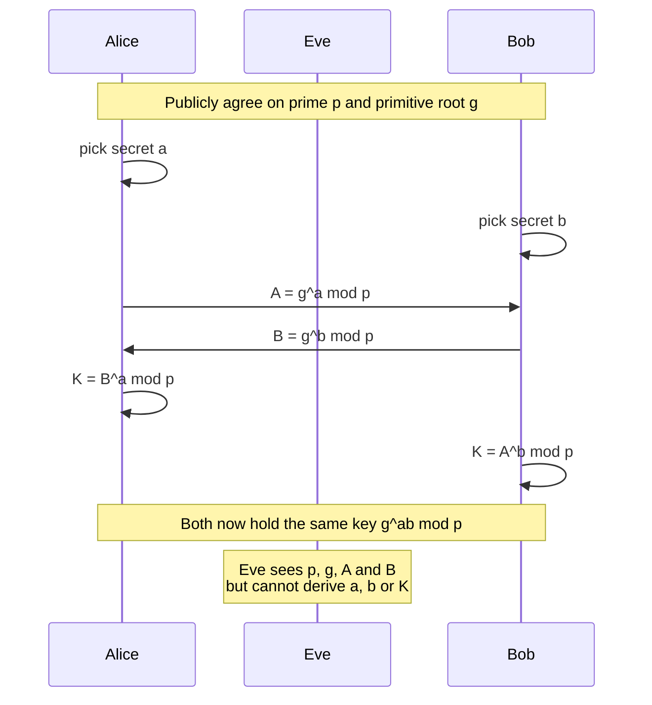

# Diffie–Hellman Key Exchange

> **Source:** `Module 1/Diffie Hellman 1.3.pdf`, pages 1–8 · **Syllabus:** Unit I
> *(The source deck spells it "Excahnge"/"excange" — corrected throughout.)*

## Key points

- DH securely establishes a **shared secret key over a public channel**. It is **not an encryption algorithm**.
- One of the first public-key protocols, conceived in **1976**.
- Both parties agree publicly on a large prime **p** and a **primitive root g of p**; each keeps a private exponent.
- Alice sends `g^a mod p`, Bob sends `g^b mod p`; both compute the same `g^ab mod p`.
- Security rests on the **discrete logarithm problem** — knowing `p`, `g`, `g^a mod p`, `g^b mod p` does not yield `a`, `b`, or the key.
- Neither party can compute the shared secret **without the other's cooperation**.
- DH is **unauthenticated** and therefore vulnerable to man-in-the-middle unless combined with authentication.

---

## 1. Introduction

- The Diffie–Hellman key exchange algorithm is a method of **securely exchanging cryptographic keys over a public channel**.
- It was one of the **first public-key protocols**, conceived in **1976**.
- DH is one of the earliest practical examples of public key exchange implemented within the field of cryptography.
- It allows two parties to **jointly establish a shared secret key over an insecure channel**.
- **DH is not an encryption algorithm** — it produces a key, it does not encrypt data. The key it produces is then used with a symmetric cipher.

Two important properties:

1. The resulting shared secret **cannot be computed by either party without the cooperation of the other**.
2. A third party observing **all** the messages transmitted during the exchange **cannot deduce the resulting shared secret**.

## 2. Primitive root

A **primitive root of a prime number `n`** is a number `a` where `a < n` and:

> `a^i mod n` gives a **unique** result for every `i = 1, 2, 3, …, (n−1)`

That is, the powers of `a` generate every value from 1 to n−1 exactly once before repeating.

### Worked example: n = 7

| a | a¹ | a² | a³ | a⁴ | a⁵ | a⁶ | All unique? |
|---|---|---|---|---|---|---|---|
| 1 | 1 | 1 | 1 | 1 | 1 | 1 | ✗ |
| 2 | 2 | 4 | 1 | 2 | 4 | 1 | ✗ |
| **3** | 3 | 2 | 6 | 4 | 5 | 1 | ✓ |
| 4 | 4 | 2 | 1 | 4 | 2 | 1 | ✗ |
| **5** | 5 | 4 | 6 | 2 | 3 | 1 | ✓ |
| 6 | 6 | 1 | 6 | 1 | 6 | 1 | ✗ |

*(All values are `aⁱ mod 7`.)*

**The primitive roots of 7 are 3 and 5.**

## 3. Basic idea

A and B are two persons wishing to communicate. Each generates a random number — `a` and `b` respectively.

- A sends `f(a)` to B
- B sends `f(b)` to A

So now:
- **A knows** `a` and `f(b)`
- **B knows** `b` and `f(a)`

There exists another function `g` such that:

```
g(a, f(b)) = g(b, f(a))
```

- The key used by A is `g(a, f(b))`.
- The key used by B is `g(b, f(a))`.

Since these are equal, both parties end up holding the same key without ever transmitting it.

## 4. The algorithm

1. **A and B agree on two large numbers `p` and `g`**, where `p` is prime and `g` is a **primitive root of `p`**. These are public.
2. **A selects a random integer `a`**, where `a < p`, and computes
   `f(a) = g^a mod p`  ← A's public key
3. **B selects a random integer `b`**, where `b < p`, and computes
   `f(b) = g^b mod p`  ← B's public key
4. **A sends** `g^a mod p` to B.
5. **B sends** `g^b mod p` to A.
6. **B evaluates** `(g^a mod p)^b` to be used as the key.
7. **A evaluates** `(g^b mod p)^a` to be used as the key.
8. Both parties now hold the common number **`g^ab mod p`**.

This is the **symmetric (secret communication) key** used by both A and B.

**Why it is secure:** although eavesdroppers know `p`, `g`, `g^a mod p` and `g^b mod p`, they still cannot evaluate the key because **they do not know either `a` or `b`** — recovering them would mean solving the discrete logarithm problem.

## 5. Block diagram



## 6. Numerical example

*Secret values are marked in bold.*

- Alice and Bob **publicly agree** to use a modulus **p = 23** and base **g = 5** (5 is a primitive root modulo 23).
- Alice chooses a secret integer **a = 6**, then computes her public key
  `A = g^a mod p = 5^6 mod 23 = 8`
- Bob chooses a secret integer **b = 15**, then computes his public key
  `B = g^b mod p = 5^15 mod 23 = 19`
- Alice sends Bob her computed public key, **A = 8**.
- Bob sends Alice his calculated public key, **B = 19**.
- Alice uses Bob's public key to compute the shared key:
  `K_A = B^a mod p = 19^6 mod 23 = 2`
- Bob uses Alice's public key to compute the shared key:
  `K_B = A^b mod p = 8^15 mod 23 = 2`

**Shared secret key = 2.**

| Step | Alice | Public channel | Bob |
|---|---|---|---|
| Agree | p = 23, g = 5 | → ← | p = 23, g = 5 |
| Choose secret | a = 6 | | b = 15 |
| Compute public | A = 5⁶ mod 23 = **8** | | B = 5¹⁵ mod 23 = **19** |
| Exchange | send 8 → | | ← send 19 |
| Compute key | 19⁶ mod 23 = **2** | | 8¹⁵ mod 23 = **2** |

It is very difficult for anyone to figure out the shared key even if they eavesdrop and learn the prime `p = 23` and the generator `g = 5`, **because they do not know either Alice's or Bob's secret number**. Eve knows neither `a` nor `b`, so she cannot proceed with the calculation.

## 7. Limitation — the man-in-the-middle problem

DH as described establishes a shared key but **does not authenticate who is on the other end**. An attacker positioned between Alice and Bob can run a separate exchange with each of them, ending with one key shared with Alice and another shared with Bob, and relay (and read) all traffic.

This is why real protocols run DH **inside an authenticated exchange** — for example [IKE Phase 1](04-ipsec.md#9-internet-key-exchange-ike), which performs a Diffie–Hellman exchange and then authenticates the peer using certificates or a pre-shared secret.
