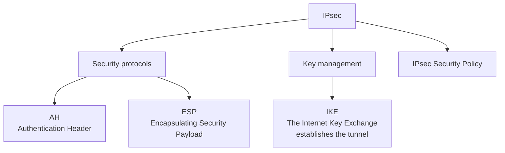
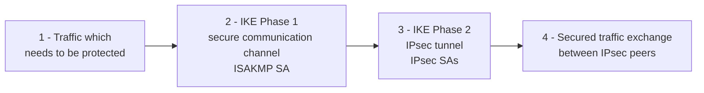
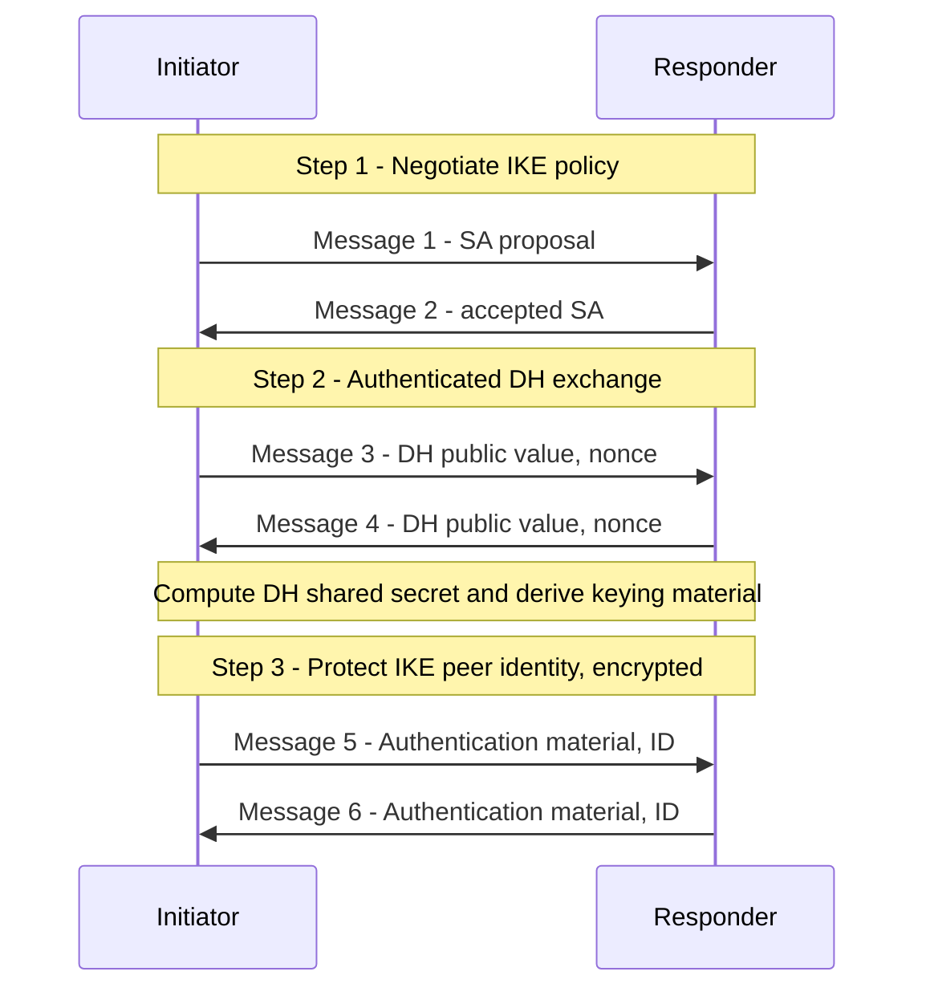
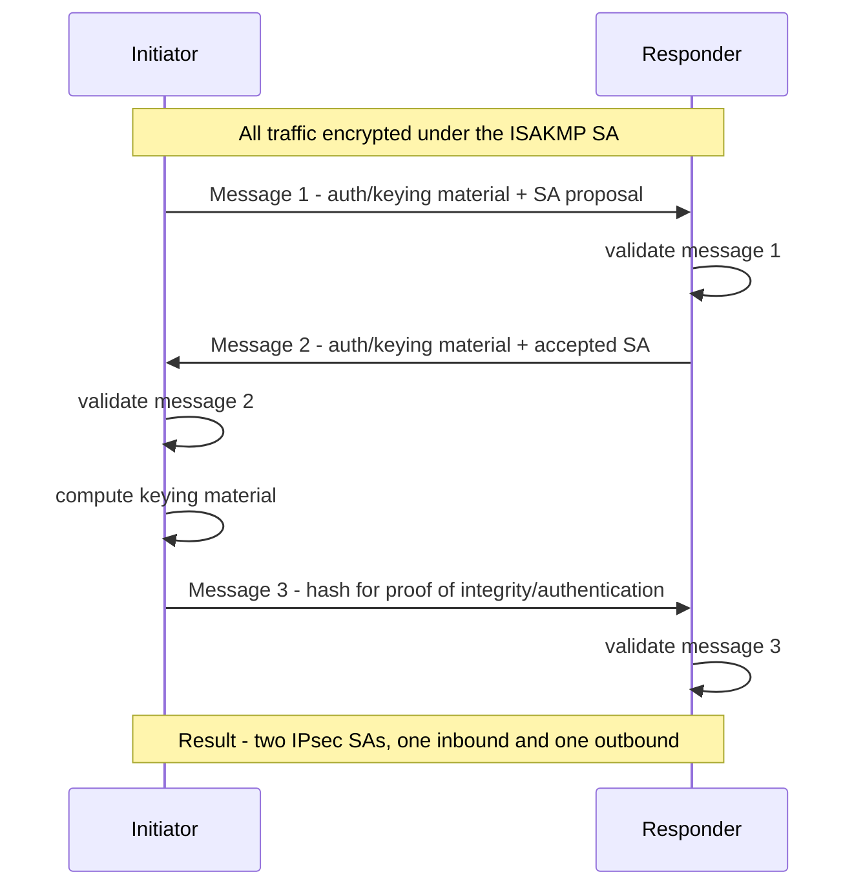

# IPsec

> **Source:** `Module 1/IPSec Basics.pdf` (APNIC eLearning, eSEC03_v1.0), pages 1–31 · **Syllabus:** Unit I
> *(Pages 32–34 are the survey slide, helpdesk chat and closing slide — no technical content.)*

## Key points

- IPsec provides **Layer 3 (network layer) security**, so it is **transparent to applications**.
- It is a **suite**: Security Associations (SA) + Authentication Header (AH) + Encapsulating Security Payload (ESP) + Internet Key Exchange (IKE).
- **AH** (protocol 51) = authentication + integrity. **ESP** (protocol 50) = all of AH **plus confidentiality**.
- **Transport mode** inserts an IPsec header into the existing packet; **tunnel mode** wraps the whole packet in a new one.
- An **SA is unidirectional** — bidirectional communication needs two.
- **IKE Phase 1** builds the ISAKMP SA (main or aggressive mode); **Phase 2** builds the IPsec SAs (quick mode).
- Best practice: **ESP with strong algorithms (3DES/AES, SHA) and PFS**.

---

## 1. Virtual Private Networks

A VPN **creates a secure tunnel over a public network**. Deployment shapes:

- Client to firewall
- Router to router
- Firewall to firewall

It uses the Internet as the **public backbone** to access a secure private network — for example, remote employees accessing their office network.

**VPN protocols:**

| Protocol | Name |
|---|---|
| PPTP | Point-to-Point Tunneling Protocol |
| L2F | Layer 2 Forwarding Protocol |
| L2TP | Layer 2 Tunneling Protocol |
| **IPsec** | Internet Protocol Security |

## 2. What is IPsec?

- Provides **Layer 3 security** (RFC 2401) — it is **transparent to applications**, so no integrated IPsec support is needed in them.
- A **set of protocols and algorithms** used to secure IP data at the **network layer**.
- Combines different components:
  - **Security Associations (SA)**
  - **Authentication Header (AH)**
  - **Encapsulating Security Payload (ESP)**
  - **Internet Key Exchange (IKE)**
- A security context for the VPN tunnel is established via **ISAKMP**.

### Why IPsec? — IP is not secure

The IP protocol was designed in the early stages of the Internet, when security was not an issue and **all hosts in the network were known**. The resulting security issues:

- **Source spoofing**
- **Replay packets**
- **No data integrity or confidentiality**

### IPsec standards

| RFC | Defines |
|---|---|
| **RFC 4301** | "The IP Security Architecture" — the original IPsec architecture and elements common to both AH and ESP |
| **RFC 4302** | Authentication Header (AH) |
| **RFC 4303** | Encapsulating Security Payload (ESP) |
| **RFC 2408** | ISAKMP |
| **RFC 5996** | IKEv2 (September 2010) |
| **RFC 4835** | Cryptographic algorithm implementation for ESP and AH |

## 3. Benefits of IPsec

> *(The source deck states these across two consecutive slides with overlap; merged here.)*

- **Confidentiality** — by encrypting data.
- **Integrity** — routers at each end of a tunnel calculate the **checksum or hash value** of the data.
- **Authentication** — signatures and certificates.
- All of the above **while still maintaining the ability to route through existing IP networks**.

**Data integrity and source authentication**
- Data is **"signed"** by the sender and the **"signature"** is verified by the recipient.
- Modification of data can be detected by signature **verification**.
- Because the signature is based on a **shared secret**, it also gives **source authentication**.

**Anti-replay protection**
- **Optional**: the sender *must* provide it, but the recipient *may* ignore it.

**Key management (IKE)**
- Session negotiation and establishment.
- Sessions are **rekeyed or deleted automatically**.
- Secret keys are securely established and authenticated.
- The remote peer is authenticated through varying options.

> "IPsec is designed to provide interoperable, high quality, cryptographically-based security for IPv4 and IPv6" — RFC 2401

### Where IPsec sits among the layers

| Layer | Encryption technology |
|---|---|
| Application layer | SSL, PGP, SSH, HTTPS |
| **Network layer** | **IPsec** |
| Link layer | Link-layer encryption |

## 4. IPsec modes

| | **Tunnel mode** | **Transport mode** |
|---|---|---|
| What happens | The **entire IP packet is encrypted** and becomes the data component of a **new (and larger) IP packet** | The IPsec header is **inserted into** the existing IP packet |
| New packet created? | **Yes** — a new IP header is added | **No** |
| Packet size | Larger | Minimal increase — works well in networks where increasing packet size could cause an issue |
| Typical use | **Site-to-site VPNs** | **Remote-access VPNs** |

```
Without IPsec:      [ IP Header ][ TCP Header ][ Payload ]

Transport mode:     [ IP Header ][ IPsec Header ][ TCP Header ][ Payload ]

Tunnel mode:        [ New IP Header ][ IPsec Header ][ IP Header ][ TCP Header ][ Payload ]
```

## 5. IPsec architecture



- **AH** — Authentication Header  } security protocols
- **ESP** — Encapsulating Security Payload  }
- **IKE** — The Internet Key Exchange; **establishes the tunnel**, handles key management
- **IPsec Security Policy** — governs what traffic gets protected and how

## 6. Security Associations (SA) and ISAKMP

### Security Association

- A **collection of parameters required to establish a secure session**.
- Uniquely identified by **three parameters**:
  1. **Security Parameter Index (SPI)**
  2. **IP destination address**
  3. **Security protocol identifier (AH or ESP)**
- **An SA is unidirectional** — **two SAs are required for bidirectional communication**.
- A single SA can be used for AH **or** ESP, **but not both** — you must create two (or more) SAs for each direction if using both.

### Setting up an SA

| Method | How |
|---|---|
| **Manually** ("manual keying") | Configure on each node: participating nodes (i.e. traffic selectors); AH and/or ESP (tunnel or transport); cryptographic algorithm and key |
| **Automatically** | Using **IKE** (Internet Key Exchange) |

### ISAKMP

- **Internet Security Association and Key Management Protocol**, defined by **RFC 2408**.
- Used for establishing **Security Associations and cryptographic keys**.
- Only provides the **framework** for authentication and key exchange — the **key exchange itself is independent**.
- Key exchange protocols that plug into it: **IKE** (Internet Key Exchange) and **KINK** (Kerberized Internet Negotiation of Keys).

## 7. AH and ESP

| | **Authentication Header (AH)** | **Encapsulating Security Payload (ESP)** |
|---|---|---|
| IP protocol number | **51** | **50** |
| Source authentication | ✓ | ✓ |
| Data integrity | ✓ | ✓ |
| **Confidentiality** | ✗ | **✓** (symmetric key encryption) |
| Protection against | Source spoofing, replay attacks | Same, plus disclosure |
| Coverage | Authentication applied to the **entire packet**, with **mutable fields in the IP header zeroed out** | Authentication applied to data in the IPsec header **and** the payload |

**AH specifics**
- In IPv4, AH protects the payload and **all header fields except mutable fields and IP options** (such as the IPsec option).
- If **both AH and ESP** are applied to a packet, **AH follows ESP**.

**ESP specifics**
- Must **encrypt and/or authenticate** in each packet.
- **Encryption occurs before authentication.**

**Mutable IP header fields** (excluded from AH authentication): **ToS, TTL, Header Checksum, Offset, Flags**.

## 8. Packet format alteration

### AH — transport mode

```
Before:  [ Original IP Header ][ TCP/UDP ][ Data ]

After:   [ Original IP Header ][ AH Header ][ TCP/UDP ][ Data ]
                       |________________________________________|
                       Authenticated except for mutable fields
                       in the IP header (ToS, TTL, Header
                       Checksum, Offset, Flags)
```

### ESP — transport mode

```
Before:  [ Original IP Header ][ TCP/UDP ][ Data ]

After:   [ Original IP Header ][ ESP Header ][ TCP/UDP ][ Data ][ ESP Trailer ][ ESP Auth ]
                                             |__________________________|
                                                      Encrypted
                               |_________________________________________|
                                                   Authenticated
```

### AH — tunnel mode

```
Before:  [ Original IP Header ][ TCP/UDP ][ Data ]

After:   [ New IP Header ][ AH Header ][ Original IP Header ][ Data ]
                |_________________________________________________|
                Authenticated except for mutable fields in the
                NEW IP header
```

### ESP — tunnel mode

```
Before:  [ Original IP Header ][ TCP/UDP ][ Data ]

After:   [ New IP Header ][ ESP Header ][ Original IP Header ][ TCP/UDP ][ Data ][ ESP Trailer ][ ESP Auth ]
                                        |________________________________________________|
                                                          Encrypted
                          |______________________________________________________________|
                                                       Authenticated
```

Note the key difference: in **tunnel mode the original IP header is itself protected**, which is what hides the internal addressing of a site-to-site VPN.

## 9. Internet Key Exchange (IKE)

> "An IPsec component used for performing mutual authentication and establishing and maintaining Security Associations." — **RFC 5996**

- Typically used for establishing IPsec sessions; it is a **key exchange mechanism**.
- Uses **UDP port 500**.
- **Five variations** of an IKE negotiation:
  - **Two modes** — aggressive and main mode
  - **Three authentication methods** — pre-shared key, public key encryption, and public key signature

### IKE modes

| Mode | Description |
|---|---|
| **Main mode** | **Three exchanges** of information between IPsec peers. The initiator sends one or more proposals to the other peer (responder); the responder selects a proposal. |
| **Aggressive mode** | Achieves the same result as main mode using only **3 packets**. Packet 1: initiator sends all info needed to establish the SA. Packet 2: responder returns all selected security parameters. Packet 3: finalizes authentication of the ISAKMP session. |
| **Quick mode** | Negotiates the parameters for the **IPsec session**. The entire negotiation occurs **within the protection of the ISAKMP session**. |

### The two phases

| Phase | Establishes | Using |
|---|---|---|
| **Phase I** | A **secure channel — the ISAKMP SA**. Authenticates computer identity using certificates or a pre-shared secret. | Main mode or aggressive mode |
| **Phase II** | A secure channel between computers intended for the **transmission of data — the IPsec SA**. | Quick mode |

### Overview of the exchange



### IKE Phase 1 — main mode

Main mode negotiates an **ISAKMP SA** which will be used to create IPsec SAs. Three steps:

1. **SA negotiation** — encryption algorithm, hash algorithm, authentication method, and which DH group to use.
2. **Do a Diffie–Hellman exchange** (see [Diffie–Hellman](03-diffie-hellman-key-exchange.md)).
3. **Provide authentication information** and **authenticate the peer**.

Six messages:



### IKE Phase 1 — aggressive mode

- Uses **3 messages (vs 6)** to establish the IKE SA.
- **No denial-of-service protection.**
- **Does not have identity protection.**
- An **optional exchange and not widely implemented.**

### IKE Phase 2 — quick mode

- **All traffic is encrypted** using the ISAKMP Security Association.
- Each quick mode negotiation results in **two IPsec Security Associations** — one inbound, one outbound.
- **Creates/refreshes keys.**



## 10. IPsec best practices

- Use IPsec to provide **integrity in addition to encryption** — use the **ESP** option.
- Use **strong encryption algorithms — 3DES and AES instead of DES**.
- Use **SHA instead of MD5** as a hashing algorithm.
- **Reduce the lifetime of the Security Association** by enabling **Perfect Forward Secrecy (PFS)**.
  - PFS increases the processor burden, so do this **only if the data is highly sensitive**.
