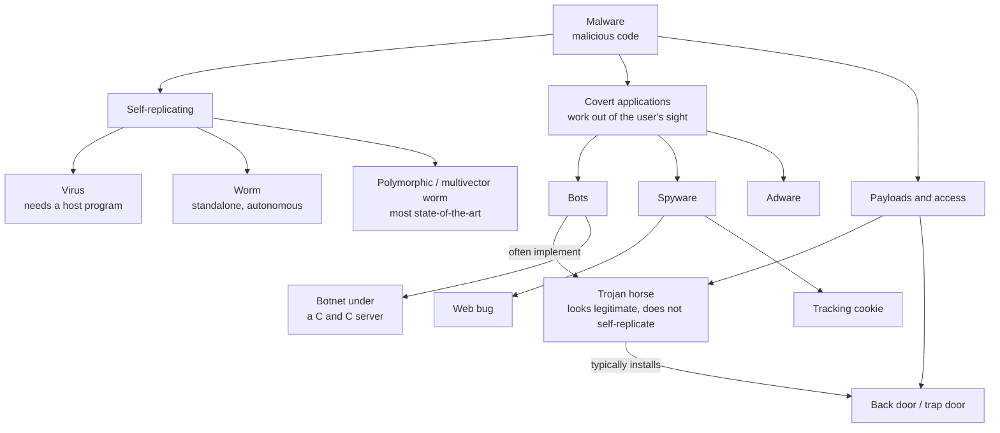

# Malware and Back Doors

> **Source:** `Module 2/Software Attacks Part 1.pdf`, pages 2–10, merged with `Module 1/Computer Network Security Introduction.pptx`, slides 28–29 · **Syllabus:** Unit II
> *This file is the single home for malware definitions in these notes; other files link here rather than repeat them.*

## Key points

- **Malware** = malicious code/software designed to **damage, destroy, or deny service** to targeted systems.
- The terminology is **not mutually exclusive** — a Trojan may be delivered as a virus, a worm, or both.
- **Virus** attaches to a host program and needs it to be run; **worm** self-replicates without a host; **Trojan** looks legitimate and does *not* self-replicate.
- **Covert malware**: bots, spyware, adware — designed to work out of the user's sight.
- A **back door** bypasses normal access controls; a designer-left one is a **maintenance hook**.
- The most state-of-the-art malicious code attack is the **polymorphic (multivector) worm**.

---

## 1. What malware is

- **Malware** is referred to as **malicious code** or **malicious software** (also *malcode*). Other attacks that use software — like **redirect attacks** and **denial-of-service attacks** — also fall under this threat.
- These software components or programs are designed to **damage, destroy, or deny service** to targeted systems.
- More broadly: code or software specifically designed to **damage, disrupt, steal, or inflict some other "bad" or illegitimate action** on data, hosts, or networks.
- **Important caveat:** the terminology used to describe malware is **often not mutually exclusive**. For instance, Trojan horse malware may be delivered as a virus, a worm, or both.
- **Malicious code attacks** include the execution of **viruses, worms, Trojan horses, and active Web scripts** with the intent to destroy or steal information.
- The **most state-of-the-art** malicious code attack is the **polymorphic worm**, or **multivector worm**.

### Covert software applications

Other forms of malware are **covert applications** — designed to work **out of users' sight** or to be triggered by an apparently innocuous user action:

| Form | Description |
|---|---|
| **Bots** | Often the technology used to **implement Trojan horses, logic bombs, back doors, and spyware**. |
| **Spyware** | Placed on a computer to **secretly gather information about the user and report it**. |
| **Adware** | Covert software that serves advertising. |

Two specific types of spyware:

- **Web bug** — a **tiny graphic** referenced within the HTML content of a Web page or e-mail, used to collect information about the user viewing the content.
- **Tracking cookie** — placed on users' computers to **track their activity across different Web sites** and build a detailed profile of their behaviour.

## 2. Few dangerous malware attacks

> Transcribed from the table on page 4 of the source deck.

| Malware | Type | Year | Estimated systems infected | Estimated financial damage |
|---|---|---|---|---|
| **MyDoom** | Worm | 2004 | 2 million | $38 billion |
| **Klez** (and variants) | Virus | 2001 | 7.2% of Internet | $19.8 billion |
| **ILOVEYOU** | Virus | 2000 | 10% of Internet | $5.5 billion |
| **Sobig F** | Worm | 2003 | 1 million | $3 billion |
| **Code Red** (and CR II) | Worm | 2001 | 400,000 servers | $2.6 billion |
| **SQL Slammer** (a.k.a. Sapphire) | Worm | 2003 | 75,000 | $950 million to $1.2 billion |
| **Melissa** | Macro virus | 1999 | Unknown | $300 million to $600 million |
| **CIH** (a.k.a. Chernobyl) | Memory-resident virus | 1998 | Unknown | $250 million |
| **Storm Worm** | Trojan horse virus | 2006 | 10 million | Unknown |
| **Conficker** | Worm | 2009 | 15 million | Unknown |
| **Nimda** | Multivector worm | 2001 | Unknown | Unknown |
| **Sasser** | Worm | 2004 | 500,000 to 700,000 | Unknown |
| **Nesky** | Virus | 2004 | Under 100,000 | Unknown |
| **Leap-A/Oompa-A** | Virus | 2006 | Unknown (Apple) | Unknown |

Note how the classifications in this table cut across each other — **Storm Worm** is listed as a *Trojan horse virus* and **Nimda** as a *multivector worm*, which is exactly the "terminology is not mutually exclusive" point made above.

## 3. Virus

- A computer virus consists of **code segments (programming instructions) that perform malicious actions**.
- The code behaves much like a **biological virus pathogen** that attacks animals and plants — using the cell's own replication machinery to propagate the attack beyond the initial target.
- The code **attaches itself to an existing program** and takes control of that program's access to the targeted computer. The virus-controlled target program then carries out the virus plan by **replicating itself into additional targeted systems**.
- A virus **propagates by inserting a copy of itself into, and becoming part of, another program**, spreading from one computer to another and leaving infections as it travels.
- **The virus may exist on a system but will not be active or able to spread** until a user or the operating system **runs or opens** the malicious host file or program.
- One of the most common transmission methods is the **e-mail attachment file**. Most organizations block e-mail attachments of certain types and filter all e-mail for known viruses.

### Classifying viruses

| Basis | Classes |
|---|---|
| **Target** | **Macro viruses** (in word processors, spreadsheets, database applications); **boot viruses** (in computer boot sectors) |
| **Programming, storage and movement** | **Binary executables** (`.exe`, `.com`); **interpretable data files** (command scripts, application documents); or both |
| **Memory behaviour** | **Memory-resident** — persist in memory and **reactivate upon boot**, continuing until shutdown; or **non-memory-resident** |

## 4. Worms

- Worms **replicate functional copies of themselves** and can damage the system.
- They can **continue replicating until they completely fill available resources** — memory, hard drive space, and network bandwidth.
- The complex behaviour of worms can be initiated **with or without the user downloading or executing the file** — this is the key difference from a virus.
- To spread, worms either **exploit a vulnerability** on the target system or use **social engineering** to trick users into executing them.
- Once a worm has infected a computer it can:
  - **redistribute itself to all e-mail addresses** found on the infected system, and
  - **deposit copies of itself onto all Web servers** the infected system can reach — users who subsequently visit those sites become infected.

## 5. Trojan horses

- A **harmful piece of software that looks legitimate**. Users are typically **tricked into loading and executing it** on their systems.
- Frequently **disguised as helpful, interesting, or necessary software** — such as the `readme.exe` files often included with shareware or freeware packages.
- **Unlike viruses and worms, Trojans do not reproduce by infecting other files, nor do they self-replicate.**
- A Trojan typically **creates back doors** to give malicious users access to the system.

### Case study: Happy99.exe

Around **20 January 1999**, Internet e-mail users began receiving messages with an attachment named **`Happy99.exe`**.

1. When the attachment was opened, a brief multimedia program displayed **fireworks and the message "Happy 1999."**
2. While the fireworks display was running, the **Trojan horse program was installing itself** into the user's system.
3. The program **propagated itself** by following up every e-mail the user sent with a **second e-mail to the same recipient**, with the same attack program attached.

## 6. Back doors (trap doors)

- A **malware payload that provides access to a system by bypassing normal access controls**. Equivalently: an **undocumented way of accessing a system, bypassing the normal authentication mechanisms**.
- A back door may also be an **intentional access control bypass left by a system designer** to facilitate development.
- Using a known or newly discovered access mechanism, an attacker can gain access to a system or network resource through a back door.
- **Viruses and worms can carry a payload that installs a back door or trap door component**, allowing the attacker to access the system at will **with special privileges**.

**Maintenance hook.** When such a door is left behind by system designers or maintenance staff, it is called a **maintenance hook**.

**Attacker-installed back doors.** More often, attackers place a back door into a system or network they have **already compromised**, making their **return to the system much easier next time**.

**Why they are hard to find.** A trap door is hard to detect because the person or program that places it usually:
- makes the access **exempt from the system's usual audit logging features**, and
- makes every attempt to keep the back door **hidden from the system's legitimate owners**.

## 7. Social engineering

> "Any act that influences a person to take an action that may or may not be in their best interests."

It is the **psychological manipulation of people into performing actions**.

**Example — phishing SMS/e-mail:** *"your account is about to be suspended unless a link provided is clicked to update your card/account information"*.

Social engineering is one of the delivery routes for worms and Trojans, and is also one of the eight [network vulnerability classes](02-network-device-vulnerabilities.md#25-phishing-and-social-engineering-attacks) in its own right.

## 8. Related terms

| Term | Definition |
|---|---|
| **Exploit** | A piece of software which is **not always malicious in intent** — sometimes used only as a way of **demonstrating that a vulnerability exists**. |
| **Bot** | Bots often **automate tasks** and provide information or services that would otherwise be conducted by a human. A **malicious bot** is self-propagating malware designed to infect a host and **connect back to a central server** that acts as a **command and control (C&C) center**. |
| **Botnet** | An entire network of compromised devices under the control of a C&C center. |
| **Zombie** | A compromised machine directed remotely by the attacker — the raw material for [DDoS](04-dos-spoofing-and-mitm.md#1-denial-of-service-dos-and-ddos). |
| **Ransomware** | Encrypts files and demands payment to restore access — see [Introduction to Cyber Security](01-cyber-security-introduction.md#4-major-cyber-security-threats-and-attacks). |

## 9. Quick comparison

| | **Virus** | **Worm** | **Trojan horse** |
|---|---|---|---|
| Needs a host program | **Yes** — attaches to an existing program | **No** — standalone | **No** — is itself the "program" |
| Self-replicates | Yes, when the host runs | **Yes, autonomously** | **No** |
| Needs user action | Yes — user/OS must run the host file | **Not necessarily** | **Yes** — user is tricked into running it |
| Typical damage | Corrupts/steals via the host program | Exhausts memory, disk, bandwidth | **Installs a back door** for remote access |
| Spread route | E-mail attachments, infected files | Vulnerability exploitation or social engineering; e-mail address books, Web servers | Disguise as useful software |
