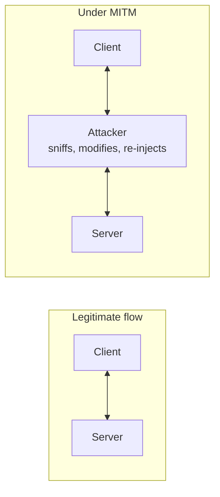

# Denial of Service, Spoofing and Man-in-the-Middle

> **Source:** `Module 2/Software Attacks Part 1.pdf`, pages 11–15 · **Syllabus:** Unit II

## Key points

- **DoS** overwhelms a target's ability to handle incoming communications, blocking legitimate users.
- **DDoS** = the same attack launched from **many locations simultaneously**, usually preceded by a preparation phase that turns thousands of machines into **bots/zombies**.
- Any Internet-connected system providing **TCP-based services** is vulnerable.
- **Spoofing** = forging or modifying the **source IP address** so messages appear to come from a trusted host.
- **MITM** = sniff → modify → re-inject packets; **TCP/session hijacking** uses address spoofing to impersonate a legitimate entity.

> These are the network-level realisations of the X.800 **active attacks** — masquerade, replay, modification of messages, and denial of service. See [OSI Security Architecture](../module-1/02-osi-security-architecture-x800.md#types-of-active-attack) for the taxonomy.

---

## 1. Denial-of-Service (DoS) and DDoS

**Definition.** An attack that attempts to **overwhelm a computer target's ability to handle incoming communications**, prohibiting legitimate users from accessing those systems.

**Mechanism.** The attacker sends a **large number of connection or information requests** to a target. So many requests are made that the target system becomes **overloaded and cannot respond to legitimate requests** for service.

**Distributed denial-of-service (DDoS).** A **coordinated stream of requests** is launched against a target **from many locations at the same time**.

- Most DDoS attacks are preceded by a **preparation phase** in which many systems — perhaps thousands — are compromised.
- The compromised machines are turned into **bots or zombies**: machines that are **directed remotely by the attacker**.

### What is vulnerable

- **Any system connected to the Internet and providing TCP-based network services** — a Web server, FTP server, or mail server — is vulnerable to DoS attacks.
- DoS attacks can also be launched against **routers or other network server systems** if these hosts enable other TCP services, such as **echo**.

### Notable DoS attacks in history

| When | Event |
|---|---|
| — | **Michael Calce (a.k.a. Mafiaboy)** attacked Amazon.com, CNN.com, ETrade.com, ebay.com, Yahoo.com, Excite.com and Dell.com. The software-based attacks lasted **approximately four hours** and reportedly resulted in **millions of dollars in lost revenue**. |
| **January 2002** | The British ISP **CloudNine** is believed to be the **first business "hacked out of existence"** by a DoS attack. |
| **January 2016** | A group calling itself **New World Hacking** attacked the **BBC's Web site**. If the scope is verified it would qualify as the **largest DDoS attack in history**, at an attack rate of **602 Gbps**. The group hit **Donald Trump's campaign Web site** the same day. |

> For the specific protocol-level techniques used to mount these attacks — SYN flood, ICMP flood, Ping of Death, DNS amplification — see [Protocol, DNS, ARP and TCP/IP Attacks](05-protocol-dns-arp-tcp-attacks.md).

## 2. Spoofing

**Definition.** A technique for gaining **unauthorized access to computers using a forged or modified source IP address**, to give the perception that messages are coming from a **trusted host**.

**How it is done.** To engage in IP spoofing, hackers use a variety of techniques to:

1. **Obtain trusted IP addresses**, and then
2. **Modify the packet headers** to insert these forged addresses.

Spoofing is the enabling technique behind several other attacks in this module — it is what makes [DNS amplification](05-protocol-dns-arp-tcp-attacks.md#15-dns-amplification), [ARP poisoning](05-protocol-dns-arp-tcp-attacks.md#3-arp-poisoning) and [TCP/IP hijacking](05-protocol-dns-arp-tcp-attacks.md#4-tcpip-hijacking) work.

## 3. Man-in-the-Middle (MITM)

**Definition.** An attacker **monitors (or sniffs) packets from the network, modifies them, and inserts them back into the network**.

**TCP hijacking / session hijacking.** In a TCP hijacking attack — also known as **session hijacking** — the attacker uses **address spoofing to impersonate other legitimate entities** on the network.

**What the attacker gains.** MITM allows the attacker to **eavesdrop**, as well as to:

- **change**
- **delete**
- **reroute**
- **add**
- **forge**, or
- **divert**

data.

This is the pattern behind [DNS poisoning via MITM](05-protocol-dns-arp-tcp-attacks.md#21-how-dns-poisoning-works) and [TCP/IP hijacking](05-protocol-dns-arp-tcp-attacks.md#4-tcpip-hijacking); both are specific instances of the general MITM position described here.
