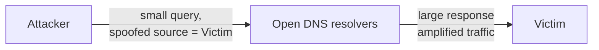
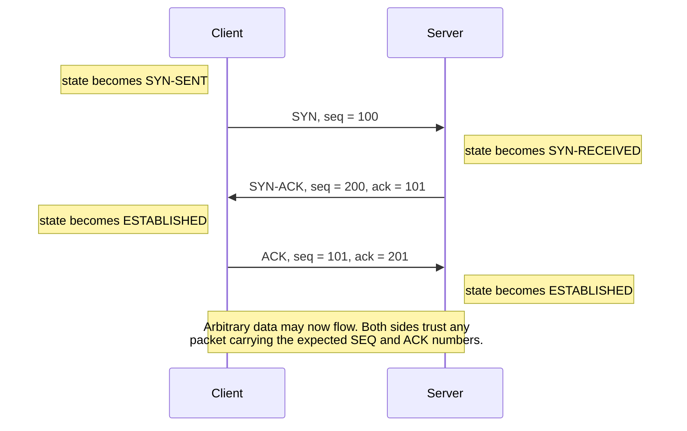
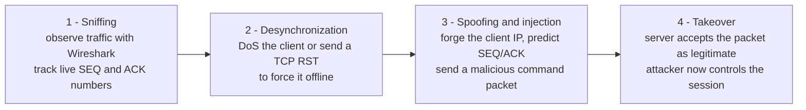

# Protocol-Based, DNS, ARP and TCP/IP Attacks

> **Source:** `Module 2/Software Attacks Part 1.pdf`, pages 16–30 · **Syllabus:** Unit II

## Key points

- **Protocol-based DDoS** targets the **rules of how devices talk**, not raw bandwidth — fake, broken or incomplete packets exhaust connection-handling resources at lower layers.
- Examples: **SYN flood, ICMP flood, Ping of Death, DNS amplification**; **IoT botnets** supply the firepower.
- **DNS poisoning** (a.k.a. DNS spoofing / DNS cache poisoning) inserts falsified data into a DNS cache, redirecting users to unintended sites.
- **ARP spoofing** links the attacker's MAC to a LAN IP; **ARP poisoning** is the follow-on corruption of the ARP table.
- **TCP/IP hijacking** seizes an already-authenticated session — because authentication happens **only at session start**, hijacking bypasses passwords entirely.
- Its four stages: **sniffing → desynchronization → spoofing & injection → takeover**.

---

## 1. Protocol-based (DDoS) attacks

**Definition.** A protocol-based DDoS attack is a type of distributed denial of service attack that **targets the rules of how devices talk to each other on the internet**.

**How it differs from a volumetric attack.**
- Instead of using **massive amounts of data**, attackers send packets that are **fake, broken, or incomplete**.
- These **confuse the target system** and force it to waste time and power. The malicious traffic **slows down or blocks legitimate traffic** from getting through.
- Protocol DDoS attacks target **lower network layers** — **routers, firewalls, operating systems**. They **exploit system connection handling**, needing **fewer requests than volumetric attacks** to cause problems.

**Goal and result.** Goal: **make the service unavailable**. Result: **downtime, lost income, damaged reputation**.

### 1.1 IoT botnets

**Cameras and routers are often poorly protected, always online, and easy to control.** They launch **strong, hard-to-stop flooding attacks**.

> This is exactly why [IoT vulnerabilities](02-network-device-vulnerabilities.md#27-iot-vulnerabilities) matter beyond the compromised device itself — the device becomes a weapon aimed at someone else.

### 1.2 SYN flood

- Attacks the **TCP three-way handshake**.
- Attackers send **many SYN packets but don't complete the handshake**.
- The server **allocates resources and waits** for the connection that never completes.
- SYN floods **exhaust server memory**, blocking legitimate users. It is an **old but still common** DDoS technique.

### 1.3 ICMP flood (ping flood)

- Overwhelms a target with a **massive number of ICMP Echo Request packets**.
- **Each request requires the system or network device to generate a response.**
- As the number of requests grows, **bandwidth and processing resources are consumed** responding to the attack traffic.
- Unlike pure volumetric attacks that rely only on raw bandwidth, ICMP floods **exploit a built-in network diagnostic protocol** to overload systems.

### 1.4 Ping of Death

- A **classic DoS attack** that sends **malformed or oversized ICMP packets** that **exceed the limits defined by the IP protocol**.
- When vulnerable systems attempt to **reassemble or process** these packets, they may **crash, freeze, or reboot**.
- Modern systems are typically **patched** against this exploit, but it remains a well-known example of how **malformed protocol packets can disrupt services**.

### 1.5 DNS amplification

- Abuses **open DNS resolvers**.
- Attackers send **queries for large DNS records** while **spoofing the victim's IP address**.
- The DNS servers then send **large responses back to the victim**, dramatically increasing the volume of traffic.
- With amplification techniques, attackers can generate **gigabits of malicious traffic with minimal effort**.

### Comparison of protocol DDoS techniques

| Attack | Protocol abused | Mechanism | Resource exhausted |
|---|---|---|---|
| **SYN flood** | TCP | Half-open handshakes never completed | Server memory / connection table |
| **ICMP flood** | ICMP | Mass Echo Requests demanding replies | Bandwidth + processing |
| **Ping of Death** | ICMP / IP | Malformed, oversized packets | Crashes the reassembly logic |
| **DNS amplification** | DNS (UDP) | Spoofed queries for large records via open resolvers | Victim's bandwidth |

---

## 2. DNS poisoning

**Definition.** DNS poisoning occurs when **falsified data infiltrates a domain name server's cache**, causing DNS queries to return **erroneous responses and redirect users to unintended websites**.

It also goes by the names **"DNS spoofing"** and **"DNS cache poisoning."**

**What is DNS?** A DNS **catalogues domain names and their corresponding IP addresses**. A DNS server maintains records of these associations, directing users to the appropriate IP address for the website name entered.

### 2.1 How DNS poisoning works

**1. Man-in-the-Middle attacks**
The attacker **interposes themselves between the user's web browser and the DNS server**. A specialized tool is then employed to **corrupt the cached data on the device** and manipulate the DNS server's records, subsequently redirecting the user to a malicious website.

**2. DNS server hijack**
Upon **compromising a DNS server**, an attacker **manipulates its configuration**, redirecting users to a malicious destination. This falsified DNS information ensures that **any user** attempting to access the legitimate website is instead **rerouted to the fraudulent platform**.

**3. DNS cache poisoning via spam**
Attackers leverage **spam** by **embedding cache poisoning code within emails**. These messages frequently employ **scare tactics** to coerce users into clicking malicious links, thereby initiating the DNS poisoning exploit.

### 2.2 The risks of DNS poisoning

| Risk | Consequence |
|---|---|
| **1. Data theft** | The user is redirected to a **phishing website** that collects private information. What the user enters is sent to the attacker, who can use it or **sell it to another criminal**. |
| **2. Malware infection** | Criminals infect user computers with malware via malicious websites, through **drive-by downloads or malicious links**. Recognizing infection signs helps users remove malicious programs and protect data. |
| **3. Halted security updates** | Attackers can **spoof security update sites**, leaving computers vulnerable — a second-order effect that keeps the victim exploitable. |
| **4. Censorship** | Censorship can be executed via DNS manipulation. **In China, the government changes DNS to allow only approved websites.** |

---

## 3. ARP poisoning

### 3.1 What is ARP?

- In **2001**, developers introduced the **Address Resolution Protocol (ARP)** to Unix developers, describing it as a **"workhorse"** that could establish IP-level connections to new hosts.
- The foundation of ARP lies in **Media Access Control (MAC)**. A MAC address is a **unique, hardware-level identifier for an Ethernet network interface card (NIC)**. These identifiers are **factory-assigned**, though **software modifications are possible** — which is precisely what makes spoofing feasible.

**An ARP should:**

| Function | Behaviour |
|---|---|
| **Accept requests** | A new device asks to join the local area network (LAN), providing an IP address. |
| **Translate** | Devices on the LAN **don't communicate via IP address** — ARP translates the IP address to a **MAC address**. |
| **Send requests** | If ARP doesn't know the MAC address for an IP address, it sends an **ARP packet request**, querying other machines on the network to get what's missing. |

### 3.2 The two types of ARP attack

| Attack | What happens |
|---|---|
| **ARP spoofing** | A hacker sends **fake ARP packets** that link **the attacker's MAC address with the IP of a computer already on the LAN**. |
| **ARP poisoning** | After a successful ARP spoofing, the hacker **changes the company's ARP table** so it contains **falsified MAC maps**. **The contagion spreads.** |

**The goal** is to **link the hacker's MAC with the LAN**. The result: **any traffic sent to the compromised LAN will head to the attacker instead**.

**At the end of a successful ARP attack, a hacker can:**
- **Hijack**
- **Deny service**
- **Sit in the middle**

---

## 4. TCP/IP hijacking

**Definition.** TCP/IP hijacking — or **transport-layer session hijacking** — denotes a **man-in-the-middle (MITM) cyberattack**. It involves an attacker **intercepting and seizing control of an established, authenticated network connection** between a client and a server.

**Why it is so powerful:** as **authentication typically occurs solely at session initiation**, the successful hijacking of an established connection **grants the attacker immediate access, bypassing the need for passwords**.

### 4.1 How TCP works

- Establishing a TCP connection involves a **"3-way handshake"**, which verifies the **mutual intent to connect**.
- During the handshake, devices exchange connection parameters: **initial sequence (SEQ) and acknowledgment (ACK) values**, and the desired **window size**.
- **Upon completion of the 3-way handshake, devices are authorized to transmit arbitrary data.**

### 4.2 Mechanics of TCP/IP

| Element | Meaning |
|---|---|
| **Three-way handshake** | A connection is initiated via the **SYN, SYN-ACK, ACK** packet sequence. |
| **Sequence (SEQ) numbers** | A **32-bit number** assigned to the initial byte of a packet's data; maintains **data sequence** and guarantees **packet integrity**. |
| **Acknowledgment (ACK) numbers** | The **receiver's anticipated next sequence number**. |
| **Trust state** | Upon successful completion of the handshake, **both parties inherently trust any incoming packet bearing the correct and anticipated SEQ and ACK numbers.** |

That last row is the vulnerability: **trust is placed in the numbers, not in the identity.**

### 4.3 The hijacking process

1. **Sniffing** — the attacker employs tools such as **Wireshark** to observe traffic between the target client and server, **monitoring active SEQ and ACK numbers**.
2. **Desynchronization** — attackers disrupt the client–server connection synchronization, typically through a **DoS attack** or by sending a **TCP Reset (RST) packet** to the client, forcing it offline or compelling it to disregard the server.
3. **Spoofing & injection** — the attacker **counterfeits the client's IP address (IP spoofing)**, then **anticipates the required SEQ/ACK numbers** and dispatches a **malicious command packet** to the server.
4. **Takeover** — the server **validates the malicious packet as legitimate** because the sequence numbers align, **granting the attacker control**.

### 4.4 Preventive measures

- **Do not click** on unwanted or unknown links.
- **Check the web application for all errors.**
- Use an **Intrusion Detection System (IDS)** to monitor network traffic for unwanted or unknown activity and to **detect ARP spoofing/poisoning** — see [IDS and IPS](08-ids-and-ips.md).
- **Use a switch instead of a hub** for increased security.
- Always **send the session ID over SSL**.
- **Use a different session ID for each page.**
