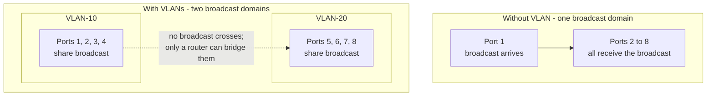
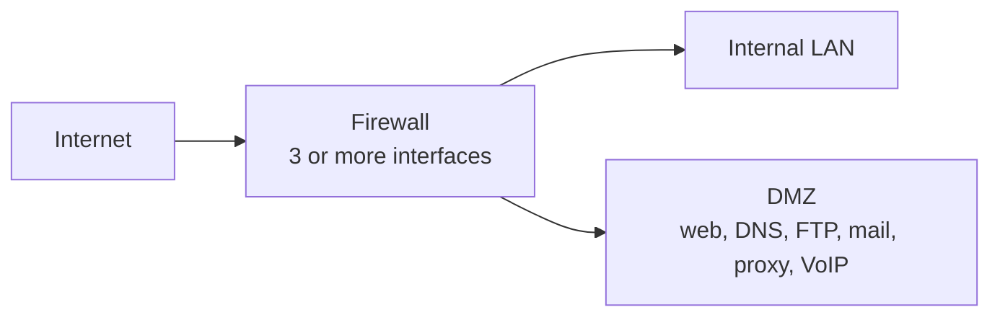
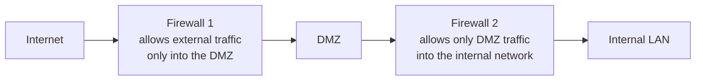
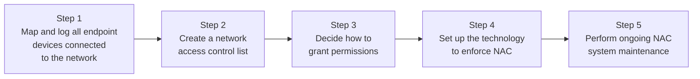

# VLAN, DMZ and Network Access Control

> **Source:** `Module 2/Software Attacks Part 2.pdf`, pages 2–19 · **Syllabus:** Unit II

## Key points

- A **VLAN** is a **logical grouping of network resources** on administratively defined switch ports; it **breaks one large broadcast domain into smaller ones**.
- VLANs are a **switch-only feature**; devices in different VLANs **cannot communicate directly — only through a router**.
- **VLANs operate at Layer 2, subnets at Layer 3** — both are approaches to logical segmentation.
- A **DMZ** is a **perimeter network** holding external-facing services, buffering the internet from the private LAN.
- **Dual-firewall DMZ** is more secure than single-firewall: an attacker must compromise **both**.
- The security focus has shifted from **outward attacks to internal breaches** — which is what **NAC** exists to address.
- NAC comes in **pre-admission** and **post-admission** forms, and automates policy enforcement from a **centralized server**.

---

## 1. Virtual LAN (VLAN)

### 1.1 What a VLAN is

A VLAN is a **logical grouping of network resources connected to administratively defined ports on a switch**. VLANs **break a large broadcast domain into smaller broadcast domains** — **each VLAN creates a separate broadcast domain**.

**Basic concepts and fundamentals:**

- **LANs** — devices in a single Ethernet network. **Broadcast messages reach all devices in a LAN** for essential tasks.
- To improve network performance, administrators **break LAN networks into smaller LANs**, because broadcast messages from many devices reduce performance.
- **VLANs are smaller LANs.** They **create a boundary for broadcast messages**: a broadcast message within a VLAN reaches all devices in it, **but does not go outside**. Devices in different VLANs **do not exchange broadcast messages**.

### 1.2 How VLANs work

**Without VLANs.** A switch does not understand broadcast messages. When it receives a broadcast message on one of its ports, it **forwards that message out of all the remaining ports**. For example, an **8-port switch** receiving a broadcast on **port 1** forwards it out of **ports 2 through 8**.

**With VLANs.** A VLAN is a **switch-only feature**. It allows us to **define ports that share broadcast messages**:
- If two switch ports belong to **different** VLANs, they **do not** share broadcast messages.
- If two ports belong to the **same** VLAN, they **do** share broadcast messages.

**Worked example.** On the same 8-port switch, create **VLAN-10** and **VLAN-20**. Assign **ports 1–4 to VLAN-10** and **ports 5–8 to VLAN-20**. After this:
- ports 1, 2, 3, 4 share broadcast within **VLAN-10**
- ports 5, 6, 7, 8 share broadcast within **VLAN-20**

### 1.3 Key points about VLANs

- VLANs are a **switch-only feature** — they work only on **manageable Ethernet switches**.
- VLANs **create boundaries for broadcast messages**.
- VLANs **do not share broadcast messages**.
- **Devices in different VLANs cannot communicate directly** — they communicate **through a router**.
- You can **create and use the same VLAN on multiple switches**, which allows you to arrange devices **logically** rather than physically.
- All switches have a **default VLAN, called VLAN1**.
- **By default, all switch ports belong to VLAN1.**

### 1.4 Advantages and disadvantages

| Advantages | Disadvantages |
|---|---|
| Solve the **broadcast problem** | **Increase network cost** |
| **Reduce the size of broadcast domains** | **Add complexity** to the network |
| Add an **additional layer of security** | |
| Make **device management easier** | |
| Implement **logical grouping of devices by function instead of location** | |

### 1.5 VLANs vs. subnets

VLANs and subnets are the **two most common approaches to logical segmentation**.

| | **VLANs** | **Subnets** |
|---|---|---|
| **Layer** | **Layer 2** | **Layer 3** |
| **How they work** | Create multiple **virtual networks within a physical infrastructure**; assign specific **ports, switches, or users**; **isolate traffic** between VLANs | Create segments with **distinct subnet address ranges** |
| **What they enable** | Broadcast containment and logical grouping | **Efficient IP address management**; **access control and security policy enforcement at the subnet level**; **network addressing schemes for automated provisioning and configuration** |

---

## 2. Demilitarized Zone (DMZ)

### 2.1 What a DMZ is

A **DMZ (demilitarized zone)** is a **perimeter network** that protects and **adds an extra layer of security to an organization's internal local-area network from untrusted traffic**.

**Goal.** Allow the organization to **access untrusted networks (e.g. the internet) while keeping the private network secure**. Organizations store **external-facing services and resources** in the DMZ — for example:

- DNS servers
- FTP servers
- Mail servers
- **Proxy servers** (see [Proxy Servers and Honeypots](07-proxy-servers-and-honeypots.md))
- VoIP servers
- Web servers

**Effect.** A DMZ **isolates servers from the LAN**, making it harder for hackers to access internal data via the internet. This **minimizes LAN vulnerabilities**, creating a safe environment for communication and information sharing.

### 2.2 How a DMZ works

- Businesses with public websites need **internet-accessible web servers**. To protect internal networks, **web servers are kept separate from internal resources**. DMZs allow communication between protected business resources and **qualified** internet traffic.
- A DMZ network **buffers the internet and an organization's private network**. It is **isolated by a security gateway, such as a firewall**, which filters traffic between the DMZ and the LAN. The DMZ server itself is protected by another security gateway that filters **external** network traffic.
- The DMZ setup **places it between two firewalls**, ensuring incoming packets are **screened by a firewall before reaching DMZ-hosted servers**.
- **Defence in depth:** if an attacker breaches the external firewall and compromises a DMZ system, they **still need to pass an internal firewall** to reach sensitive corporate data. A skilled attacker might breach a secure DMZ, but the resources within it **should trigger alarms**, providing warning of the ongoing breach.

### 2.3 DMZ design and architecture

**Single firewall**
- Requires **three or more network interfaces**:
  1. The **external network** — connects the public internet connection to the firewall.
  2. The **internal network**.
  3. The connection to the **DMZ**.
- Various **rules monitor and control** the traffic allowed to access the DMZ and **limit connectivity to the internal network**.

**Dual firewall** — *generally the more secure option*
- Deploy **two firewalls with the DMZ between them**.
- The **first firewall only allows external traffic to the DMZ**.
- The **second only allows traffic that goes from the DMZ into the internal network**.
- **An attacker would have to compromise both firewalls** to gain access to the organization's LAN.

---

## 3. Network Access Control (NAC)

### 3.1 The security issue NAC addresses

- The security issues facing enterprise networks have **evolved over the years**, with the focus moving from **mitigating outward attacks** to **reducing internal breaches and the infiltration of malicious software**.
- This internal defence requires **significant involvement with individual devices** on a network, which creates **greater overhead on network administrators**.

### 3.2 The evolution of network defence

- For many years the focus was on defending against **external threats** — firewalls protected the LAN from hackers, worms, spammers and other Internet dangers.
- However, with the **growth in mobile computing** and the **proliferation of Ethernet-capable devices**, **LAN-based attacks are now the main security issue, outnumbering external threats**. Attention has turned to **internal LAN security**.
- **Malware enters networks through employees, contractors, and visitors** — often via **personal devices, gadgets, and USB drives**.
- **Visitors and contractors** may carry malware or plan malicious attacks to **steal data or cause disruption**.

> This is the same problem as the [insider threat](02-network-device-vulnerabilities.md#26-insider-threats) vulnerability class, viewed from the network-control side.

### 3.3 Defence against the enemy within

- Network administrators need **secure LAN switches** to protect against internal threats and common attacks. Networks need **anti-malware policies** to secure devices.
- Administrators can **require network users to install anti-malware scanners and security patches**.
- But this caused administrators to **spend time on policy adherence and created tension** with users — the manual approach does not scale.

### 3.4 The solution is NAC

- NAC allows network administrators to **automate policy enforcement**. Rather than *requesting* that users ensure their devices conform to anti-malware policies, administrators **let the network do the job instead**.
- NAC offers an excellent way to **control network access with automated policy enforcement**, and to **manage network security without vast administration overhead**.
- NAC lets you **define and enforce a comprehensive network security policy from a centralized server**.
- **NAC is much more than just user authentication** — it is also designed to **protect the network from users and devices that may be authorized but still pose threats**.

### 3.5 Types of NAC

| | **Pre-admission** | **Post-admission** |
|---|---|---|
| **When it acts** | **Before** users obtain access | **After** admission, while the user is on the network |
| **What it does** | **Assesses, authenticates, and admits** users when they seek to connect to corporate networks | **Monitors user actions** (pre-admission authentication may remain in place as well) |
| **Mechanisms** | User credentials stored on **secure databases**; **access protocols specify requirements devices must meet** before entry is permitted; **third-party authentication services** generally used for extra assurance via **MFA** | **Internal firewalls segregate resources**; **security protocols limit access based on privileges** |
| **On violation** | Entry is refused | If endpoints **try to breach privileges**, post-admission NAC systems **shut them down and deny access** |

A **hybrid** approach combining both is also possible.

### 3.6 NAC implementation steps

Methods vary depending on the **contours of each network**, the number of **IoT devices and third-party gadgets** involved, the **budget** of the company, and the decision to choose **pre-admission, post-admission, or hybrid** solutions. Some basic steps are common to most NAC deployments:

1. **Map and log all endpoint devices connected to the network.**
   Survey network edges: **IoT, employee devices, and centralized equipment**.

2. **Create a network access control list.**
   A list of **authorized users and their access levels**. **Record user identities in a central database.**

3. **Decide how to grant permissions to authorized users.**
   Establish permissions **by role, not individually**. Apply the **principle of least privilege** — allow access only to what is needed.

4. **Set up the technology required to implement your access control list.**
   **Test the access portal** to ensure relevant users can obtain access and that systems **exclude unauthorized users**.

5. **Create and maintain systems to update the NAC system as required** — i.e. **perform ongoing NAC system maintenance**.
   Access control lists **change as corporate network layouts change**. Applications need **regular updates** to ensure antivirus, access control and encryption technologies stay current.

