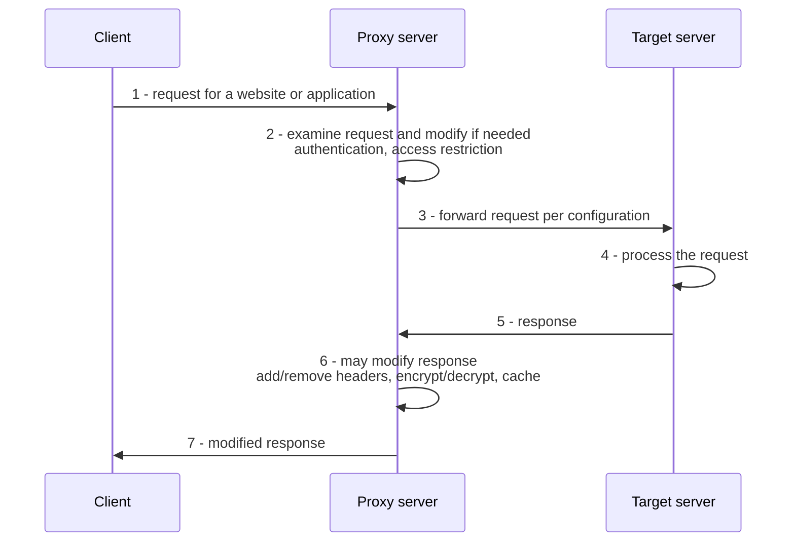

# Proxy Servers and Honeypots

> **Source:** `Module 2/Software Attacks Part 2.pdf`, pages 20–41 · **Syllabus:** Unit II

## Key points

- A **proxy server** is an **intermediary** between users and the internet — it hides the user's IP, adds a security layer, and controls what data flows in and out.
- Request flow: **client → proxy (examines/modifies) → server → proxy (may modify/cache) → client**.
- Proxies are classified by **traffic flow, use, protocol, anonymity, and IP source**; the key split is **forward** (shields clients) vs **reverse** (shields servers).
- A **honeypot** is a **deliberately created decoy system** that mimics real, vulnerable services — bait, holding no actual data.
- Its **three functions**: **diverting attackers, information gathering, extended engagement**.
- Multiple connected honeypots form a **honeynet**, mimicking an entire network.

---

## 1. Proxy servers

### 1.1 What a proxy server is

- A proxy server is a **system or router that provides a gateway between users and the internet**. It therefore **helps prevent cyber attackers from entering a private network**.
- It is called an **"intermediary"** because it **goes between end-users and the web pages they visit** online.
- The proxy server is the **gateway to the internet** — acting as a **middleman between the user's device and the web**.
- It **hides the user's IP address**, **adds a layer of security**, and helps **control what data comes in and out** of the user's network.

### 1.2 How a proxy works

1. **The client makes a request** — a client, such as a web browser, requests access to a website or application hosted on the internet.
2. **The request reaches the proxy server** — the proxy receives it first, acting as the **entry point for all incoming traffic** from the client.
3. **The proxy examines the request** and determines if **modification is needed** — e.g. authentication, access restriction.
4. **The proxy forwards the request** to the internet or the appropriate server, **based on its configuration**.
5. **The selected server processes the request** and returns a response, which is sent back to the proxy server.
6. **The proxy can modify the response** — for example **add/remove headers, encrypt/decrypt, or cache** the content.
7. **The client receives the modified response** and uses it to render the website or application.

### 1.3 Proxy server design and architecture

| Component | Role |
|---|---|
| **Proxy user interface** | Allows admins or users to **configure and manage proxy settings**. |
| **Proxy server listener** | **Monitors and forwards** client requests. |
| **Connection manager** | Facilitates **efficient communication** between clients and web servers. |
| **Cache manager** | Stores **frequently accessed data locally** to reduce latency and improve response times. |
| **Log manager** | Records **all requests and responses** for monitoring, auditing, and troubleshooting. |
| **Configuration module** | The **rules and settings** that govern the proxy server's operations. |

### 1.4 Reasons to use a proxy

- **Anonymous browsing** — proxies **hide IP addresses** for private, secure browsing, especially on **public Wi-Fi** or sensitive sites.
- **Caching and bandwidth optimization** — proxies monitor websites and provide faster access through **local caching**, reducing bandwidth usage and speeding up access to frequently visited sites.
- **Monitoring and logging user activity** — analyzing browsing habits, detecting misuse, maintaining organizational integrity.
- **Improving cybersecurity** — acting as an intermediate layer, a proxy can also **function as a firewall**. It **blocks malicious sites, analyzes them before connection, detects unauthorized downloads**.
- **Load balancing for large networks** — proxies balance workloads by integrating servers to **distribute user requests efficiently**, minimizing delays and optimizing browsing during peak times.

### 1.5 Classification of proxies

| Basis | Types |
|---|---|
| **Traffic flow** | Forward proxy, Reverse proxy |
| **Use** | Residential, Datacenter, Anonymous, Public, Private, Dedicated, Shared, Rotating, Mobile |
| **Protocol** | HTTP proxies and HTTPS/SSL proxies, SOCKS proxies, DNS proxies |
| **Anonymity** | Transparent, Distorting, Anonymous, Elite anonymity |
| **IP source** | Datacenter, Residential, ISP, Mobile |

### 1.6 Types of proxy in detail

> Presented as one table because the categories overlap across the classification bases above.

| Proxy type | How it works | Best for | Trade-offs |
|---|---|---|---|
| **Forward proxy** | Positioned **next to clients**; sits in front of clients and gets data to groups of users within an internal network. Handles requests from end users, **masking IP addresses** and serving as a **single point of entry for network administration**. When a request is sent, the proxy examines it to decide whether to proceed with making a connection. | Internal networks needing controlled, centrally administered egress | **Latency and single-point failures** can arise due to multiple user connections |
| **Reverse proxy** | **Shields web servers from clients** (the opposite of a forward proxy). **Intercepts client requests before they reach the backend server.** | **Popular websites** that need to balance the load of many incoming requests; helps **reduce bandwidth load** by acting like another web server managing incoming requests | Can potentially **expose the HTTP server architecture** if an attacker penetrates it — admins may need to **beef up or reposition their firewall** |
| **Residential proxy** | Gives you an IP address that **belongs to a specific, physical device**; all requests are channeled through that device | Users who need to **verify the ads on their website** — blocking cookies, suspicious or unwanted ads from competitors or bad actors | **More trustworthy** than other options, but often **costs more money** |
| **Anonymous proxy** | **Hides the user's IP address but reveals that a proxy is being used.** Level 1: hides the IP and **doesn't show the proxy is used**; Level 2: hides the IP but **informs that the proxy is being used** | **Basic anonymity** | **Not ideal for high-security tasks** |
| **Public proxy** | **Freely available**, often used by casual users | Users for whom **cost is the major concern** and security and speed are not | Usually **unreliable, slow, and potentially unsafe** due to lack of control and unknown hosting sources; **increased risk of your information being accessed by others** |
| **Private proxy** | **Dedicatedly assigned to each user** — no sharing | Safe web browsing, **data scraping, social media management, e-commerce automation**; confidential tasks | Offers **higher anonymity**; costs more than shared |
| **Shared proxy** | **Multiple users share the same proxy server** | General web surfing or general bot tasks | **Cost-effective**, but **slower speeds** and **potential security risks** due to shared access |
| **Rotating proxy** | **Assigns a different IP address to each user that connects.** As users connect, each gets an address unique from the device that connected before it | **High-volume request activities**; **web scraping** where maintaining anonymity is crucial | — |
| **HTTP proxy** | Handles **only HTTP traffic** | Basic web browsing | **Not secure — it doesn't encrypt data** |
| **HTTPS / SSL proxy** | An extension of HTTP proxies that **supports encryption**, suitable for secure communication over **SSL/TLS** | **Online money transactions** — offers a high-level safety net | — |
| **SOCKS proxy** | A **flexible proxy that works at a lower level** and supports **multiple protocols including HTTP, FTP, and SMTP**. Handles a wide range of traffic types using **TCP**; **SOCKS5** (the current version) can handle all data types | **Peer-to-peer sharing and online gaming** | **Lacks built-in encryption** — additional security layers recommended |
| **Transparent proxy** | **Hides nothing.** Passes your **real IP address** to the target website and openly tells the site a proxy is in use. It **hides its presence** from the user, letting companies monitor employee activity without disrupting the experience | **Schools, offices, public Wi-Fi** — to **filter content, block sites, and cache pages** so they load faster for everyone | **No privacy at all** — not built for anonymity |
| **Distorting proxy** | **Identifies itself as a proxy** to a website but **hides its own identity** by changing its IP address to an **incorrect one** | People who want to **hide their location** — can make it look like you're browsing from a specific country, hiding **both your identity and the proxy's** | Some websites **automatically block distorting proxies**, which could keep a user from accessing sites they need |
| **Datacenter proxy** | **Not affiliated with an ISP** — provided by another corporation through a **data center**. The proxy server exists in a physical data center and the user's requests are routed through it | People needing **quick response times and an inexpensive solution**; gathering intelligence on a person or organization **very quickly** | **Pros:** swift, inexpensive data harvesting. **Cons:** **low anonymity**, potential risk to user info/identity |

**The core distinction to remember:**

| | **Forward proxy** | **Reverse proxy** |
|---|---|---|
| Sits in front of | **Clients** | **Servers** |
| Protects | The **client's** identity from the web server | The **web server** from clients |
| Typical purpose | Egress control, IP masking, content filtering | Load balancing, caching, extra security layer |

---

## 2. Honeypots

### 2.1 What a honeypot is

- A honeypot is a **deliberately created decoy system** designed to **attract cyber attacks by mimicking real, vulnerable network services**. It acts as **bait, appearing as a legitimate system with security flaws**.
- **Main goal:** to **lure attackers away from important or sensitive systems**, keeping them **distracted while their actions are monitored**.
- These systems **don't hold actual data** but are **configured to look valuable**.
- Once attackers interact with the honeypot, **everything they do is recorded** — including **the tools they use, the commands they run, and the vulnerabilities they try to exploit**.

### 2.2 The three key functions

| Function | What it achieves |
|---|---|
| **Diverting attackers** | Honeypots are set up to **look more vulnerable than actual systems**. This tricks attackers into interacting with them, **reducing the chances they'll reach critical servers**. |
| **Information gathering** | By observing how attackers behave inside the honeypot, security teams gain valuable insight — **what kind of vulnerabilities are being targeted, what malware is used, and whether the attacker is automated or manual**. |
| **Extended engagement** | **The longer an attacker interacts with the honeypot**, the more time administrators have to **log behaviour, trace the source, and prepare defensive actions** — without putting real systems at risk. |

### 2.3 Honeynets

- When **multiple honeypots are connected in a network**, they form what's called a **honeynet**.
- This creates an environment that **mimics a real network**, complete with **fake servers, services, and data**.
- A honeynet offers a **more complex decoy than a single honeypot**. It helps researchers study **more advanced or persistent attackers who target networks rather than individual machines**.
- Honeypots can **simulate internal databases or file servers**, which makes them more attractive to intruders.
- This setup also **improves threat intelligence** by revealing more about the attacker's **strategy, lateral movement, and data exfiltration attempts**.

> A honeypot is a **detection and intelligence** tool, not a preventive one — it complements, rather than replaces, the [IDS/IPS](08-ids-and-ips.md) controls.
