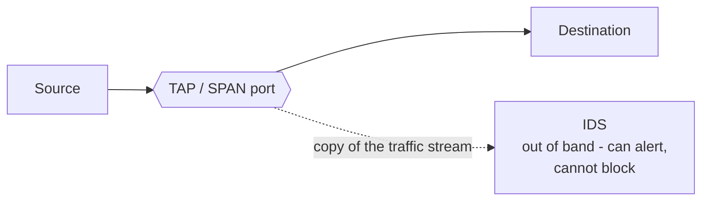
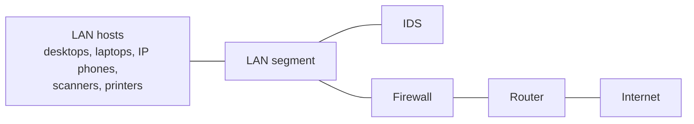
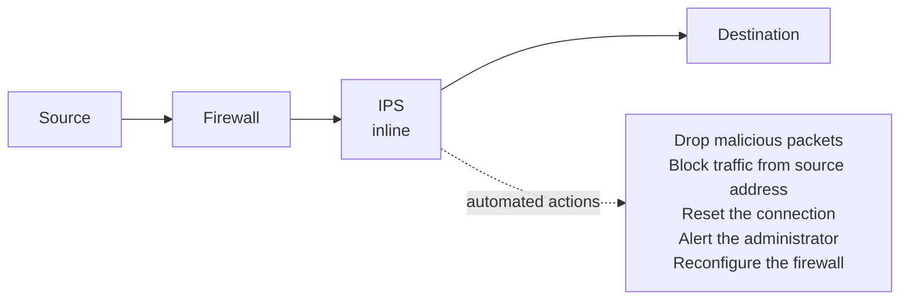

# Intrusion Detection and Prevention Systems

> **Source:** `Module 2/Software Attacks Part 2.pdf`, pages 42–63 · **Syllabus:** Unit II

## Key points

- **Intrusion** = a security policy violation affecting **confidentiality, integrity, or availability** — from external attackers *or* authorized users overstepping.
- An IDS has **three logical components**: **sensors → analyzers → user interface**.
- Two detection approaches: **misuse detection** (signatures — accurate, but blind to novel attacks) and **anomaly detection** (baselines — catches unknown attacks, but trades false positives against false negatives).
- **IDS is passive and out-of-band; IPS is active and inline.** That placement is the whole difference.
- IDS types: **NIDS** (on the network) and **HIDS** (on hosts). IPS types: **NIPS, HIPS, NBA, WIPS**.
- IPS detection techniques: **signature-based** (exploit-facing vs vulnerability-facing), **anomaly-based**, **policy-based**.

---

## 1. Core definitions

| Term | Definition |
|---|---|
| **Intrusion** | Security policy violations — attempts to affect the **confidentiality, integrity, or availability** of a computer or network. These violations can come from **external attackers** or from **authorized users overstepping their legitimate authorization levels** or conducting unauthorized activity. |
| **Intrusion detection** | The **systematic gathering of data** regarding occurrences within a computer system or network, followed by their **examination for indicators of security breaches**. |
| **Intrusion detection system (IDS)** | Products that **analyze computer/network information to detect unauthorized access attempts** and provide **real-time warnings**. |

## 2. The three logical components of an IDS

| Component | Role |
|---|---|
| **1. Sensors** | **Collect data.** Input can be any system part with intrusion evidence — **network packets, log files, and system call traces**. Sensors collect and **forward information to the analyzer**. |
| **2. Analyzers** | Get input from **sensors or other analyzers** and **determine intrusions**. Output indicates an intrusion, possibly with **evidence and action guidance**. |
| **3. User interface** | Enables a user to **view output** from the system or **control its behavior**. In some systems this equates to a **manager, director, or console** component. |

## 3. Basic principles — why intrusion detection matters

Intrusion detection is a defence mechanism against intrusions, **alongside authentication, access control, and firewalls**. The interest in it is motivated by three considerations:

1. **Early ejection.** If an intrusion is detected quickly enough, the intruder can be **identified and ejected before damage or data compromise**. Earlier detection means **less damage and quicker recovery**.
2. **Deterrence.** An effective IDS can serve as a **deterrent**, thus acting to **prevent** intrusions.
3. **Feedback loop.** Intrusion detection enables the **collection of information about intrusion techniques** that can be used to **strengthen intrusion prevention measures**.

## 4. Approaches to intrusion detection

Intrusion detection **assumes intruders' behavior differs from legitimate users' in quantifiable ways**. This distinction **isn't always clear, and some overlap is expected**.

There are **two general approaches**: **misuse detection** and **anomaly detection**.

| | **Misuse detection** | **Anomaly detection** |
|---|---|---|
| **Based on** | **Rules** specifying system events, sequences of events, or observable properties **believed to be symptomatic of security incidents** | Searching for **activity different from the normal behavior** of system entities and system resources |
| **How** | **Pattern-matching algorithms** operating on large databases of **attack patterns, or signatures** | Comparison against a baseline built from an **audit of activity** |
| **Advantage** | **Accurate**, generates **few false alarms** | Able to **detect previously unknown attacks** |
| **Disadvantage** | **Cannot detect novel or unknown attacks** | **Significant trade-off between false positives and false negatives** |

### The false-positive / false-negative trade-off

- The characteristic actions of an intruder **diverge** from those of an authorized user, **yet a commonality exists** within these behaviors.
- Consequently, a **broad interpretation** of intruder actions — designed to identify more intruders — will also result in **numerous false positives**: legitimate users mistaken for intruders.
- Conversely, an endeavor to **restrict false positives** through a **stringent** understanding of intruder conduct will result in an **escalation of false negatives**: intruders unrecognized as such.
- **Thus there is an element of compromise and art in the practice of anomaly detection.**

## 5. How an IDS works

- It is placed **out of band** on the network infrastructure. Consequently, it is **not in the real-time communication path** between the sender and receiver of information.
- IDS solutions often take advantage of a **TAP or SPAN port** to analyze a **copy of the inline traffic stream**. This ensures the **IDS does not impact inline network performance**.
- Network intrusion detection systems are used to **detect suspicious activity to catch hackers before damage is done** to the network.
- There are **network-based and host-based** IDSes — **host-based IDSes are installed on client computers; network-based IDSes are on the network itself**.
- An IDS works by **looking for deviations from normal activity and known attack signatures**. Anomalous patterns are **sent up the stack and examined at protocol and application layers**. It can detect events like **DNS poisonings, malformed information packets, and Christmas tree scans**.
- An IDS can be implemented as a **network security device or a software application**. To protect data and systems in cloud environments, **cloud-based IDSes** are also available.

The deck's own figure places the IDS on the **LAN side of the firewall**, watching the internal segment rather than sitting in the path to the internet:

> As the slide puts it, the IDS is a **security tool for preventing unwanted access to business networks that monitors network traffic for suspicious behavior, analyzes it in advance, and issues warnings when suspicious activity is detected**.

## 6. Types of IDS

| Type | Deployment | Focus |
|---|---|---|
| **Network-based IDS (NIDS)** | Deployed at **strategic points within a computer network**, examining **incoming and outgoing traffic** | Monitoring **network protocols, traffic patterns, and packet headers** |
| **Host-based IDS (HIDS)** | Installed on **individual machines or servers** within an IT environment | Monitoring **system logs and files** to detect **unauthorized access attempts and abnormal changes** to the system |

## 7. Benefits and limitations of IDS

| Benefits | Limitations |
|---|---|
| **Early threat detection** — proactively defend against cyberattacks by detecting potential threats at an **early stage of the intrusion** | **False positives and false negatives** — IDS tools aren't perfect; they can label **benign events as threats** and **fail to detect real threats** |
| **Greater visibility** — enhance visibility into the IT environment, helping security teams **respond more quickly and effectively** | **Inability to prevent attacks** — an IDS can **detect attacks once they occur but cannot prevent them** from occurring in the first place |

That second limitation is exactly what the IPS was created to solve.

---

## 8. Intrusion Prevention Systems (IPS)

An **intrusion prevention system (IPS)** is a cybersecurity solution that **builds on the capabilities of IDS**. IPS tools can **not only detect potential intrusions but also actively prevent and mitigate them**.

### 8.1 Why IPS is important

- IPS is chosen over traditional network security because it **proactively detects and prevents harm from malicious traffic**. It identifies threats by **monitoring network traffic using network behavior analysis**.
- Should an unauthorized attacker achieve network access, the IPS **detects the questionable activity, logs the IP address, and initiates an automatic countermeasure** following **predetermined rules established by the network administrator**.
- IPS utilizes **anti-virus, firewall, anti-spoofing, and traffic surveillance**. Organizations use IPS to **record threats, identify vulnerabilities, and mitigate security breaches**.

### 8.2 How an IPS works

- The IPS is placed **inline, directly in the flow of network traffic** between the source and destination. **This is what differentiates IPS from its predecessor, the IDS** — the IDS is a **passive** system that scans traffic and reports back on threats.
- **Behind the firewall**, the solution **analyzes traffic flows and takes automated actions**.

**Automated actions an IPS can take:**
- **Sending an alarm to the administrator** (as would be seen in an IDS)
- **Dropping the malicious packets**
- **Blocking traffic from the source address**
- **Resetting the connection**
- **Configuring firewalls to prevent future attacks**

**As an inline security component, the IPS must be able to:**
- **Work efficiently** to avoid degrading network performance
- **Work fast**, because exploits can happen in near-real time
- **Detect and respond accurately**, to eliminate threats **and** false positives

### 8.3 IPS detection techniques

Three techniques are used for finding exploits and protecting the network.

**1. Signature-based detection**
A detection method using a **dictionary of unique exploit patterns (signatures)**. When an exploit is found, its signature is **recorded in this growing dictionary**. It breaks down into **two types**:

| | **Exploit-facing signatures** | **Vulnerability-facing signatures** |
|---|---|---|
| **Target** | **Specific attack strings, malware hashes, or known exploit payloads** | **The code vulnerability itself** (e.g. how a system handles a specific type of bad input) |
| **Scope** | **Narrow** — only block the exact attack variation they were written for | **Broad** — one signature can block **dozens of different exploit variants** |
| **Bypass risk** | **High** — attackers can easily bypass them by **changing a few bytes of code** | **Low** — the defense holds even if the attacker alters the attack delivery |
| **False positives** | **Low** — they match highly specific malicious patterns | **High** — broad matching can accidentally flag legitimate network traffic |

*In short: exploit signatures target **the specific weapon** used by an attacker, while vulnerability signatures target **the underlying security flaw** in the software.*

**2. Anomaly-based detection**
Takes **samples of network traffic at random** and compares them to a **pre-calculated baseline performance level**. When traffic activity falls **outside the parameters of baseline performance**, the IPS takes action.

**3. Policy-based detection**
Requires system administrators to **configure security policies** based on the organization's security policies and network infrastructure. If any activity occurs that **breaks a defined security policy**, an **alert is triggered and sent to the admins**.

### 8.4 Types of IPS

| Type | Where it sits | What it does |
|---|---|---|
| **Network IPS (NIPS)** | Installed **only at strategic points** | Monitors **all network traffic** and proactively scans for threats |
| **Host IPS (HIPS)** | Installed on an **endpoint** | Looks at **inbound and outbound traffic from that machine only**. Works best **in combination with a NIPS**, serving as a **last line of defense** for threats that got past the NIPS |
| **Network Behavior Analysis (NBA)** | On the network | Analyzes network traffic, **identifying unusual flows** like **DDoS attacks** |
| **Wireless IPS (WIPS)** | On the Wi-Fi network | **Scans a Wi-Fi network for unauthorized access** and **kicks unauthorized devices off** the network |

### 8.5 Benefits of IPS

- **Reduced business risks and additional security**
- **Better visibility into attacks**, and therefore better protection
- **Increased efficiency** — allows inspection of **all traffic** for threats
- **Fewer resources needed** to manage vulnerabilities and patches

### 8.6 Attacks detected and prevented by IPS

- **ARP spoofing** — see [ARP poisoning](05-protocol-dns-arp-tcp-attacks.md#3-arp-poisoning)
- **Buffer overflow**
- **DDoS**
- **IP fragmentation**
- **OS fingerprinting**
- **Ping of Death**
- **Port scanning**
- **Server Message Block (SMB) probes**
- **SSL evasion**
- **SYN flood**

---

## 9. IDS vs IPS — summary

| | **IDS** | **IPS** |
|---|---|---|
| **Placement** | **Out of band** — uses a TAP/SPAN port to see a copy of traffic | **Inline** — directly in the traffic flow, behind the firewall |
| **Nature** | **Passive** — scans traffic and reports | **Active** — detects **and** prevents |
| **Response** | Raises alerts | Alerts, **drops packets, blocks source, resets connections, reconfigures firewalls** |
| **Impact on performance** | None (does not touch the inline path) | Must be efficient and fast, or it **degrades network performance** |
| **Detection methods** | Misuse (signature) and anomaly detection | **Signature-based, anomaly-based, policy-based** |
| **Types** | **NIDS, HIDS** | **NIPS, HIPS, NBA, WIPS** |
| **Key limitation** | **Cannot prevent** attacks | A false positive **blocks legitimate traffic**, not merely alerts on it |
